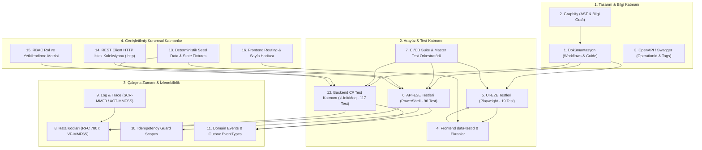
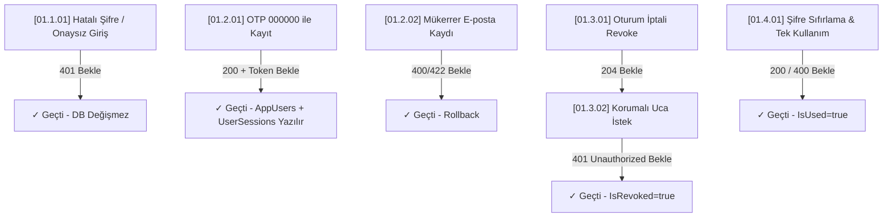
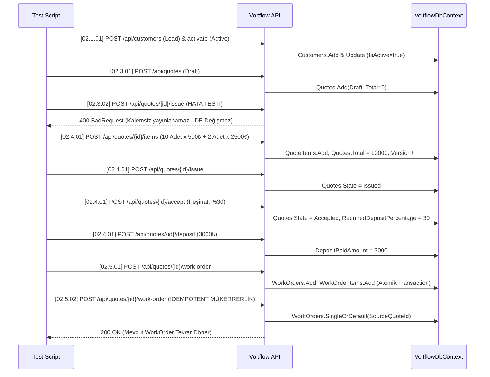
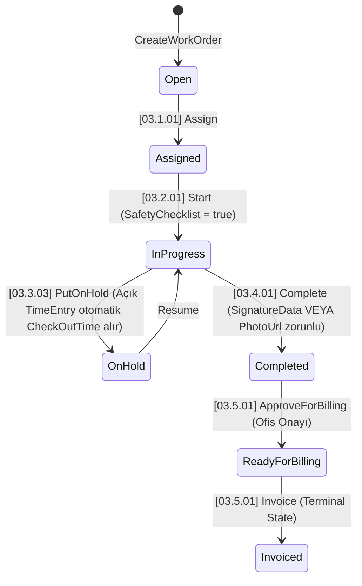
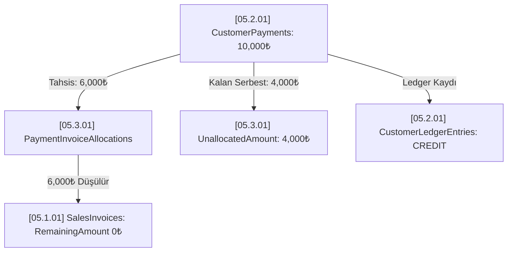

# Voltflow: Kapsamlı Dry-Test Senaryoları, DB Durumları ve Test Rehberi

Bu doküman, [`voltflow-workflows-and-failure-modes.md`](voltflow-workflows-and-failure-modes.md) belgesinde tanımlanan tüm iş akışlarının, durum geçişlerinin, hata, iptal ve rollback mekanizmalarının nasıl test edileceğini; **HTTP istek/yanıt sözleşmeleri**, **xUnit assertion kriterleri**, **işlem öncesi/sonrası Veritabanı (DB) Durumları (State Assertions & Invariants)** ve **Voltflow 12-Halkalı Mimari Senkronizasyonu** ile eksiksiz olarak açıklar.

---

## 🔗 Voltflow 12+ Halkalı Mimari Senkronizasyon Matrisi

Sistemdeki tüm kod, test ve dokümantasyon varlıkları **Voltflow Unified Taxonomy (VUT: `MM.F.SS`)** kurallarına göre 12 halkada birbirine kilitlenmiştir:



---

## Giriş: Dry-Test Yaklaşımı ve Veritabanı Doğrulama Mimarisi

Voltflow'da **Dry-Test**; gerçek e-posta sunucusu, SMS sağlayıcısı veya harici ödeme ağ geçidine fiziksel bağımlılık duymadan, sistemin iş kurallarını, durum makinelerini (FSM), atomik transaction'larını ve güvenlik bariyerlerini uçtan uca doğrulayan test metodolojisidir.

### Veritabanı Doğrulama Standartları (DB State Assertions):
1. **İşlem Öncesi Durum (Pre-Condition):** Test koşulmadan önce tabloların sahip olması gereken durum.
2. **Etkilenen Tablolar & Kolonlar:** İlgili API çağrısı veya arka plan görevinin mutasyona uğrattığı varlıklar.
3. **Başarılı İşlem Sonrası Durum (Post-Condition / Happy Path):** Yeni eklenen satırlar, güncellenen statüler, artan `Version` (Concurrency Token) ve tetiklenen `AuditEvents` / `OutboxMessages` kayıtları.
4. **Hata & Rollback Durumu (Rollback Invariant):** İş kuralı veya validasyon ihlalinde veritabanında **hiçbir satırın eklenmediği veya değişmediğinin** teyit edilmesi (`DbContext.ChangeTracker` ve transaction geri alma güvencesi).

---

## 1. Kimlik, Yetkilendirme ve Oturum (Identity & Auth) Testleri



### Senaryo [01.1.01]: Onaysız Kullanıcı ve Hatalı Giriş Reddi (VF-01101 / VF-01102)
* **Amaç:** Doğrulanmamış veya yanlış şifreli girişlerin 401 döndürdüğünü ve hiçbir oturum kaydı açılmadığını teyit etmek.
* **HTTP İsteği:**
  ```http
  POST /api/auth/login
  Content-Type: application/json

  {
    "email": "unapproved@voltflow.com",
    "password": "WrongPassword123!"
  }
  ```
* **Beklenen HTTP Yanıtı:** `401 Unauthorized`, ProblemDetails: `"Invalid credentials."` veya `"Account approval is pending."`.
* **Veritabanı Durumu (DB State):**
  * **Etkilenen Tablolar:** `UserSessions`, `AppUsers`.
  * **İşlem Öncesi:** `AppUsers` tablosunda `Email = "unapproved@voltflow.com"` olan kullanıcının `IsApproved = false`.
  * **İşlem Sonrası:** `UserSessions` tablosuna **kesinlikle yeni satır eklenmez** (`UserSessions.Count` değişmez). `AppUsers` tablosunda hiçbir alan mutasyona uğramaz.

---

### Senaryo [01.2.01]: Master OTP ile Anında Onaylı Kayıt (VF-01201 / VF-01202)
* **Amaç:** Test ortamında `000000` OTP'si ile anında onaylı kullanıcı oluşturma ve oturum açma.
* **HTTP İsteği:**
  ```http
  POST /api/auth/register
  Content-Type: application/json

  {
    "name": "Dry Test User",
    "email": "drytest@voltflow.com",
    "password": "Password123!",
    "otp": "000000"
  }
  ```
* **Beklenen HTTP Yanıtı:** `200 OK`, JSON gövdesinde `token` dolu gelir, `isApproved: true`.
* **Veritabanı Durumu (DB State):**
  * **Etkilenen Tablolar:** `AppUsers`, `AppUserRoles`, `UserSessions`, `AuditEvents`.
  * **`AppUsers` Tablosu:**
    * Yeni satır eklenir: `Name = "Dry Test User"`, `Email = "drytest@voltflow.com"`.
    * `IsApproved = true`, `IsVerified = true`.
    * `PasswordHash` alanı PBKDF2 hash değeriyle doludur (düz metin parola bulunmaz).
    * `Version = 1`.
  * **`AppUserRoles` Tablosu:** Kullanıcı ID'si ile `Technician` veya `Viewer` rol ID'si eşleştirilir (`UserId`, `RoleId`).
  * **Hata / Rollback Durumu:** Aynı e-posta ile ikinci kez istek atıldığında `400 BadRequest` döner; `AppUsers` tablosuna mükerrer kayıt eklenmez (Unique constraint / fail-fast).

---

### Senaryo [01.3.01]: Oturum İptali (Session Revocation & Redis Blacklist) (VF-01301 / VF-01302)
* **Amaç:** Çıkış yapan kullanıcının token'ının veritabanında iptal edilmesi ve korumalı uçlardan engellenmesi.
* **HTTP İstekleri:**
  1. `POST /api/auth/session/revoke` (Header: `Authorization: Bearer <TOKEN>`) $\rightarrow$ `204 No Content`.
  2. `GET /api/customers` (Aynı token ile) $\rightarrow$ `401 Unauthorized`.
* **Veritabanı Durumu (DB State):**
  * **Etkilenen Tablolar:** `UserSessions`.
  * **İşlem Öncesi:** İlgili token için `UserSessions` satırında `IsRevoked = false`, `ExpiresAt > UtcNow`.
  * **İşlem Sonrası:** İlgili token için `IsRevoked = true` yapılır. `UpdatedAt` güncellenir, `Version` 1 artar.
  * **Audit:** `AuditEvents` tablosuna oturum iptali kaydı düşer.

---

### Senaryo [01.4.01]: Şifre Sıfırlama ve Tek Kullanımlık Token (VF-01401 / VF-01402)
* **Amaç:** Şifre sıfırlama token'ının kullanımı sonrası tüketildiğinin (`IsUsed = true`) doğrulanması.
* **HTTP İstekleri:**
  1. `POST /api/auth/password-reset/request` $\rightarrow$ `200 OK`.
  2. `POST /api/auth/password-reset/complete` (Token + Yeni Şifre) $\rightarrow$ `200 OK`.
  3. Aynı token ile tekrar `POST /api/auth/password-reset/complete` $\rightarrow$ `400 BadRequest`.
* **Veritabanı Durumu (DB State):**
  * **Etkilenen Tablolar:** `PasswordResetTokens`, `AppUsers`.
  * **İşlem Sonrası:** `PasswordResetTokens` tablosundaki satırda `IsUsed = true` olur. `AppUsers` tablosunda `PasswordHash` yeni şifrenin hash'i ile güncellenir.
  * **İkinci Kullanım Denemesi:** `IsUsed == true` olduğu için reddedilir; `PasswordHash` değişmez.

---

## 2. Müşteri, Teklif ve Siparişe Dönüşüm (CRM & Quote-to-Order) Testleri



### Senaryo [02.1.01]: Müşteri Oluşturma ve Aktivasyon (Lead to Active) (VF-02101 / VF-02102)
* **Amaç:** Müşterinin pasif başlaması, veritabanına yazılması ve aktivasyonla durumunun güncellenmesi.
* **HTTP İstekleri:**
  1. `POST /api/customers` $\rightarrow$ `200 OK`, `isActive: false`, `type: "Lead"`.
  2. `POST /api/customers/{customerId}/activate` $\rightarrow$ `200 OK`, `isActive: true`.
* **Veritabanı Durumu (DB State):**
  * **Etkilenen Tablolar:** `Customers`, `AuditEvents`.
  * **Aşama 1 Sonrası:**
    * `Customers` tablosuna satır eklenir: `FullName = "Bursa Otomotiv"`, `Email = "info@bursaoto.com"`, `IsActive = false`, `Type = 0 (Lead)`.
    * `Version = 1`, `CreatedByEndpoint = "/api/customers"`.
  * **Aşama 2 Sonrası:**
    * `Customers` satırı güncellenir: `IsActive = true`, `Type = 1 (Active)`.
    * `Version = 2`, `UpdatedAt` güncellenir.
  * **Rollback Durumu:** Var olan e-posta ile tekrar istek atılırsa `400 BadRequest` döner; `Customers` tablosunda yeni satır oluşmaz.

---

### Senaryo [02.2.01]: Tesis (Site) ve Ekipman (Asset) Ekleme (VF-02201)
* **Amaç:** Hiyerarşik Tesis ve Varlık ilişkisinin veritabanı yabancı anahtarlarıyla (Foreign Key) bağlanması.
* **Veritabanı Durumu (DB State):**
  * **`CustomerSites` Tablosu:** Satır eklenir: `CustomerId = <Customer.Id>`, `Name = "Nilüfer Fabrikası"`, `Address = "Organize Sanayi Bölgesi"`.
  * **`CustomerAssets` Tablosu:** Satır eklenir: `CustomerId = <Customer.Id>`, `SiteId = <Site.Id>`, `Name = "1600kVA Dağıtım Trafosu"`, `SerialNumber = "TR-2026-09"`.
  * **Bütünlük Kuralı:** Geçersiz bir `CustomerId` gönderilirse veritabanı yabancı anahtar ihlali (FK constraint) vererek transaction'ı rollback eder.

---

### Senaryo [02.3.01]: Kalemsiz Teklif Yayınlama Engeli ve DB Değişmezliği (VF-02302)
* **Amaç:** Kalemsiz teklifin veritabanında `Issued` durumuna geçemeyeceğinin doğrulanması.
* **HTTP İsteği:**
  1. `POST /api/quotes` (CustomerId, Title) $\rightarrow$ `200 OK`, Teklif ID alınır.
  2. `POST /api/quotes/{id}/issue` $\rightarrow$ `400 BadRequest`.
* **Veritabanı Durumu (DB State):**
  * **`Quotes` Tablosu:** `State = 0 (Draft)` olarak kalır. `Total = 0`.
  * **`QuoteItems` Tablosu:** 0 satır.
  * **Değişmezlik:** Hata fırlatıldığı için `Quotes.State` kesinlikle `1 (Issued)` olmaz.

---

### Senaryo [02.4.01]: Teklif Kalem Toplamı, Kabul ve Peşinat Tahsilatı (VF-02401)
* **Adımlar:**
  1. Kalem Ekle: Miktar 10, Birim Fiyat 500 $\rightarrow$ `POST /api/quotes/{id}/items`.
  2. Kalem Ekle: Miktar 2, Birim Fiyat 2500 $\rightarrow$ `POST /api/quotes/{id}/items`.
  3. Teklifi Yayınla: `POST /api/quotes/{id}/issue`.
  4. Teklifi Kabul Et (%30 Şart): `POST /api/quotes/{id}/accept` (`{"requiredDepositPercentage": 30}`).
  5. Peşinat Öde: `POST /api/quotes/{id}/deposit` (`{"amount": 3000}`).
* **Veritabanı Durumu (DB State):**
  * **`Quotes` Tablosu:**
    * `Total = 10000.00` (Otomatik toplam: $10 \times 500 + 2 \times 2500$).
    * `State = 2 (Accepted)`.
    * `RequiredDepositPercentage = 30.00`.
    * `DepositPaidAmount = 3000.00`.
    * `Version = 5` (Her mutasyonda artar).
  * **`QuoteItems` Tablosu:** 2 adet ilişkili satır bulunur.

---

### Senaryo [02.5.01]: Tekliften İş Emrine Dönüşüm ve Idempotency Kontrolü (VF-02501 / VF-02502)
* **Amaç:** Kabul edilen tekliften atomik olarak iş emri üretilmesi ve mükerrer istekte ikinci bir iş emrinin açılmaması.
* **HTTP İstekleri:**
  1. `POST /api/quotes/{id}/work-order` $\rightarrow$ `200 OK`, `workOrderId` döner.
  2. `POST /api/quotes/{id}/work-order` (Tekrar) $\rightarrow$ `200 OK`, **aynı** `workOrderId` döner.
* **Veritabanı Durumu (DB State):**
  * **`WorkOrders` Tablosu:**
    * Yalnızca **1 adet** satır eklenir: `SourceQuoteId = <Quote.Id>`, `CustomerId = <Quote.CustomerId>`, `Total = 10000.00`, `Status = 0 (Open)`.
  * **`WorkOrderItems` Tablosu:** Teklifteki 2 kalem birebir kopyalanarak iş emrine bağlanır.
  * **Mükerrerlik Koruması:** `WorkOrders.Count(x => x.SourceQuoteId == quoteId) == 1` olmalıdır.

---

## 3. Saha Operasyonları ve İş Emri FSM Testleri (Work Orders)



### Senaryo [03.2.01]: İSG Güvenlik Kilidi (Safety Checklist Gate) (VF-03201 / VF-03202)
* **Amaç:** İSG kontrol listesi onaylanmadan iş emrinin veritabanında `InProgress` yapılamayacağının doğrulanması.
* **HTTP İstekleri:**
  1. `POST /api/workorders/{id}/assign` (Teknisyen ata) $\rightarrow$ `200 OK`.
  2. `POST /api/workorders/{id}/start` (İSG olmadan) $\rightarrow$ `400/422 BadRequest`.
  3. `POST /api/workorders/{id}/safety-checklist` $\rightarrow$ `200 OK`.
  4. `POST /api/workorders/{id}/start` $\rightarrow$ `200 OK`.
* **Veritabanı Durumu (DB State):**
  * **Aşama 2 Sonrası (Hata Anı):** `WorkOrders.Status = 1 (Assigned)` kalır. `IsSafetyChecklistCompleted = false`.
  * **Aşama 3 Sonrası:** `WorkOrders.IsSafetyChecklistCompleted = true`, `Version` artar.
  * **Aşama 4 Sonrası:** `WorkOrders.Status = 3 (InProgress)`.

---

### Senaryo [03.3.01]: Çoklu Ziyaret Zaman Takibi ve Açık Check-In Kısıtı (VF-03301 / VF-03302)
* **Adımlar:**
  1. `POST /api/workorders/{id}/check-in` (Not: "Sabah Başlangıç") $\rightarrow$ `200 OK`.
  2. `POST /api/workorders/{id}/check-in` (Mükerrer deneme) $\rightarrow$ `400/422 BadRequest`.
  3. `POST /api/workorders/{id}/check-out` (Not: "Öğle Molası") $\rightarrow$ `200 OK`.
* **Veritabanı Durumu (DB State):**
  * **`WorkOrderTimeEntries` Tablosu:**
    * Aşama 1 sonrası: 1 satır eklenir: `CheckInTime = UtcNow`, `CheckOutTime = null`, `Notes = "Sabah Başlangıç"`.
    * Aşama 2 sonrası (Hata): İkinci satır eklenmez (`Count == 1`).
    * Aşama 3 sonrası: Mevcut satır güncellenir: `CheckOutTime = UtcNow`, `Notes = "Öğle Molası"`.

---

### Senaryo [03.3.03]: Beklemeye Alma ve Otomatik Check-Out Telafisi (VF-03303)
* **Amaç:** Teknisyen Check-Out yapmadan işi On-Hold'a aldığında veritabanındaki açık sürenin otomatik kapatılması.
* **HTTP İstekleri:**
  1. `POST /api/workorders/{id}/check-in` yapılır.
  2. `POST /api/workorders/{id}/hold` (`{"reason": "Malzeme tedarik ediliyor"}`) çağrılır.
* **Veritabanı Durumu (DB State):**
  * **`WorkOrders` Tablosu:** `Status = 4 (OnHold)`, `HoldReason = "Malzeme tedarik ediliyor"`.
  * **`WorkOrderTimeEntries` Tablosu:**
    * Açık olan kaydın `CheckOutTime` alanı **kesinlikle `null` kalmaz**; o anki UTC saati ile doldurulur.
    * `Notes = "Auto check-out due to placing on hold."` olarak güncellenir.

---

### Senaryo [03.4.01]: Kanıtsız İş Kapatma Engeli ve Başarılı Kapanış (VF-03401 / VF-03402)
* **Amaç:** Kanıtsız (imza veya fotoğrafsız) kapatma isteğinin veritabanını değiştirmemesi; geçerli kanıtla kapatıldığında Outbox mesajının tetiklenmesi.
* **HTTP İstekleri:**
  1. `POST /api/workorders/{id}/complete` (`{"signatureData": null, "proofOfWorkPhotoUrl": null}`) $\rightarrow$ `400/422 BadRequest`.
  2. `POST /api/workorders/{id}/complete` (`{"proofOfWorkPhotoUrl": "https://cdn.voltflow.com/p1.jpg"}`) $\rightarrow$ `200 OK`.
* **Veritabanı Durumu (DB State):**
  * **Aşama 1 Sonrası (Hata):** `WorkOrders.Status = 3 (InProgress)` kalır.
  * **Aşama 2 Sonrası:**
    * `WorkOrders.Status = 5 (Completed)`.
    * `WorkOrders.ProofOfWorkPhotoUrl = "https://cdn.voltflow.com/p1.jpg"`.
    * Varsa açık zaman kaydı otomatik kapatılır.
    * **`OutboxMessages` Tablosu:** Yeni satır eklenir: `EventType = "EVT_03402_WorkOrderCompleted"`, `ProcessedAt = null`, `Attempts = 0`.

---

### Senaryo [03.5.01]: Ofis Onay Kapısı (Review Gate) ve Faturalama (VF-03501 / VF-03502 / VF-03503 / VF-03504)
* **HTTP İstekleri:**
  1. `POST /api/workorders/{id}/invoice` doğrudan çağrılır $\rightarrow$ `400/422 BadRequest` (`VF-03501`).
  2. `POST /api/workorders/{id}/approve-billing` çağrılır $\rightarrow$ `200 OK` (`VF-03502`).
  3. `POST /api/workorders/{id}/invoice` çağrılır $\rightarrow$ `200 OK` (`VF-03503`).
  4. `POST /api/workorders/{id}/cancel` çağrılır $\rightarrow$ `400/422 BadRequest` (`VF-03504`).
* **Veritabanı Durumu (DB State):**
  * **Aşama 1 Sonrası:** `WorkOrders.Status = 5 (Completed)` kalır.
  * **Aşama 2 Sonrası:** `WorkOrders.Status = 6 (ReadyForBilling)`.
  * **Aşama 3 Sonrası:** `WorkOrders.Status = 7 (Invoiced)` (Terminal State).
  * **Aşama 4 Sonrası:** İptal isteği reddedilir; `WorkOrders.Status` kesinlikle `Invoiced` olarak kalır, `CancellationReason` yazılmaz.

---

## 4. Depo ve Stok Yönetimi (Inventory) Testleri

### Senaryo [04.1.01]: Eksi Stok Engeli ve Atomik Rollback (VF-04101 / VF-04102)
* **Amaç:** Stok eksiye düşecekse ne stok miktarının ne de hareket kaydının veritabanına yazılmadığının (Rollback) doğrulanması.
* **HTTP İsteği:**
  ```http
  POST /api/inventory/adjust
  Content-Type: application/json

  {
    "materialCode": "NYY-4X16",
    "delta": -99999
  }
  ```
* **Beklenen HTTP Yanıtı:** `400/422 BadRequest: "Stock cannot go below zero."` (`VF-04101`).
* **Veritabanı Durumu (DB State):**
  * **`MaterialStocks` Tablosu:** `QuantityOnHand` miktarı değişmez (İşlem öncesi değerini korur).
  * **`StockMovements` Tablosu:** **Kesinlikle yeni satır eklenmez** (`StockMovements.Count` değişmez). Atomik transaction geri alınmıştır.

---

### Senaryo [04.2.01]: Stok Rezervasyonu ve İade (VF-04201 / VF-04202)
* **Adımlar:**
  1. Eldeki miktar 50 iken 30 adet rezerve edilir $\rightarrow$ `POST /api/inventory/reserve` (`VF-04201`).
* **Veritabanı Durumu (DB State):**
  * **`MaterialStocks` Tablosu:**
    * `QuantityOnHand = 50.00`.
    * `ReservedQuantity = 30.00`.
    * `AvailableQuantity` (Hesaplanan alan): `50 - 30 = 20.00`.
    * `Version` 1 artar.

---

## 5. Finans, Fatura ve Tahsilat Eşleştirme (Finance) Testleri



### Senaryo [05.1.01]: Satış Faturasında Peşinat Mahsubu (VF-05101)
* **Amaç:** Teklifte ödenen peşinatın faturanın kalan tutarından (`RemainingAmount`) otomatik düşülmesi.
* **Veritabanı Durumu (DB State):**
  * **`SalesInvoices` Tablosu:**
    * Yeni satır eklenir:
      * `GrandTotal = 10000.00`
      * `AppliedDepositAmount = 3000.00`
      * `PaidAmount = 0.00`
      * `RemainingAmount` (Hesaplanan alan): $10000 - 0 - 3000 = 7000.00$.

---

### Senaryo [05.2.01]: Tahsilat Kaydı ve Cari Hesap Defteri (Ledger Audit) (VF-05201)
* **Amaç:** Girilen tahsilatın atomik transaction ile hem ödemeler hem de cari hesap defterine alacak olarak işlenmesi.
* **HTTP İsteği:** `POST /api/payments` (`Amount: 5000.00`, `CustomerId`).
* **Veritabanı Durumu (DB State):**
  * **`CustomerPayments` Tablosu:** Satır eklenir: `Amount = 5000.00`, `AllocatedAmount = 0.00`, `UnallocatedAmount = 5000.00`.
  * **`CustomerLedgerEntries` Tablosu:** Satır eklenir:
    * `CustomerId = <CustomerId>`
    * `Amount = 5000.00`
    * `Direction = "CREDIT"`
    * `BalanceAfter = <EskiBakiye> + 5000.00`
    * `Description = "Customer payment received"`
  * **Atomik Bütünlük:** Cari deftere yazılamazsa `CustomerPayments` tablosuna da eklenmez (Rollback).

---

### Senaryo [05.3.01]: Tahsilatın Faturaya Dağıtımı ve Aşım Engeli (VF-05301 / VF-05302 / VF-05303)
* **Adımlar:**
  1. Fatura Kalan Borcu: 3,000₺, Tahsilat Tutarı: 5,000₺.
  2. Hatalı İstek: 4,000₺ bağlanmaya çalışılır $\rightarrow$ `POST /api/payments/allocate` $\rightarrow$ `400/422 BadRequest: "Invoice allocation exceeds the remaining invoice amount."` (`VF-05303`).
  3. Başarılı İstek: 3,000₺ bağlanır $\rightarrow$ `200 OK` (`VF-05301`).
* **Veritabanı Durumu (DB State):**
  * **Aşama 2 Sonrası (Hata):** `PaymentInvoiceAllocations` tablosuna satır eklenmez. Fatura ve ödeme bakiyeleri değişmez.
  * **Aşama 3 Sonrası (Başarılı):**
    * **`PaymentInvoiceAllocations` Tablosu:** 1 satır eklenir (`PaymentId`, `InvoiceId`, `Amount = 3000.00`).
    * **`CustomerPayments` Tablosu:** `AllocatedAmount = 3000.00`, `UnallocatedAmount = 2000.00`.
    * **`SalesInvoices` Tablosu:** `PaidAmount = 3000.00`, `RemainingAmount = 0.00` (Fatura tamamen kapandı).

---

## 6. Altyapı, Idempotency ve Concurrency Testleri

### Senaryo [08.1.01]: Idempotency Key Kilidi ve Gövde Uyuşmazlığı (VF-08101)
* **Adımlar:**
  1. İstek 1: `Idempotency-Key: KEY-999`, Gövde: `{"title": "Pano Bakımı"}` $\rightarrow$ `200 OK`.
  2. İstek 2: `Idempotency-Key: KEY-999`, Gövde: `{"title": "Trafo Bakımı"}` (Farklı gövde) $\rightarrow$ `409 Conflict: "Request hash mismatch"`.
  3. İstek 3: `Idempotency-Key: KEY-999`, Gövde: `{"title": "Pano Bakımı"}` (Aynı gövde) $\rightarrow$ `200 OK` (Replay).
* **Veritabanı Durumu (DB State):**
  * **`ExecutionGuards` Tablosu:**
    * İstek 1 sonrası: Satır eklenir: `Scope = "Quotes"`, `IdempotencyKey = "KEY-999"`, `RequestHash = "<SHA256>"`, `State = 1 (Resolved)`, `ResponseStatusCode = 200`, `ResponseBody = "<JSON>"`.
    * İstek 2 sonrası: Hash uyuşmazlığı nedeniyle işlem çalıştırılmaz; `ExecutionGuards` satırı değişmez.
    * İstek 3 sonrası: Servis metodu çalıştırılmaz; `ExecutionGuards` tablosundaki saklanan `ResponseBody` doğrudan istemciye dönülür.

---

### Senaryo [08.3.01]: İyimser Eşzamanlılık ve Version Token Çakışması (VF-08301)
* **Amaç:** İki kullanıcının aynı satırı eşzamanlı güncellemesinde versiyon uyuşmazlığının tespiti.
* **Veritabanı Durumu (DB State):**
  * Başlangıçta `WorkOrders` satırında `Version = 1`.
  * Kullanıcı A güncelleme yapar $\rightarrow$ `UPDATE WorkOrders SET Title = 'Yeni Başlık', Version = 2 WHERE Id = @id AND Version = 1`. Başarılı, veritabanında `Version = 2`.
  * Kullanıcı B eski veriyle güncellemeye çalışır $\rightarrow$ `UPDATE WorkOrders SET ... WHERE Id = @id AND Version = 1` $\rightarrow$ Etkilenen satır sayısı 0 döner.
  * EF Core `DbUpdateConcurrencyException` fırlatır $\rightarrow$ İstemciye `409 Conflict` döner. Kullanıcı B'nin ezici güncellemesi engellenir.

---

## 7. Test Doğrulama ve DB Durumları Matrisi (96 Senaryo & 16 Halka)

Aşağıdaki tablo, sistemdeki tüm 96 senaryonun **Voltflow Unified Taxonomy (VUT)** kodlamasını, ilgili PowerShell dry test dosyasını, UI-E2E test dosyasını, backend xUnit test sınıfını ve RFC 7807 hata/log kodlarını listeler.

| VUT Kodu | Senaryo Adı | PowerShell Dry Test | UI-E2E Testi | Backend xUnit | RFC 7807 | Log ACT |
| :---: | :--- | :---: | :---: | :---: | :---: | :---: |
| **01.1.01** | Hatalı Şifre ile Giriş Reddi (401) | `01_101` | `01_101_login_unapproved_or_wrong_password.spec.ts` | `AuthIntegrationTests.cs` | `VF-01101` | `ACT-01101` |
| **01.1.02** | Onaysız Kullanıcı Giriş Reddi (403) | `01_102` | `01_101_login_unapproved_or_wrong_password.spec.ts (Grup Akışı)` | `AuthIntegrationTests.cs` | `VF-01102` | `ACT-01102` |
| **01.1.03** | Eksik Email ile Login (400) | `01_103` | `01_101_login_unapproved_or_wrong_password.spec.ts (Grup Akışı)` | `AuthIntegrationTests.cs` | `VF-01103` | `ACT-01103` |
| **01.1.04** | Şifresiz Kayıt Denemesi (400) | `01_104` | `01_101_login_unapproved_or_wrong_password.spec.ts (Grup Akışı)` | `AuthIntegrationTests.cs` | `VF-01104` | `ACT-01104` |
| **01.2.01** | Master OTP (000000) ile Kayıt (200/202) | `01_201` | `01_201_register_with_master_otp.spec.ts` | `AuthIntegrationTests.cs` | `VF-01201` | `ACT-01201` |
| **01.2.02** | Geçersiz OTP ile Kayıt -> IsApproved=False & Girişte 403 | `01_202` | `01_201_register_with_master_otp.spec.ts (Grup Akışı)` | `AuthIntegrationTests.cs` | `VF-01202` | `ACT-01202` |
| **01.2.03** | Mükerrer E-posta Kaydı Reddi (400/409) | `01_203` | `01_201_register_with_master_otp.spec.ts (Grup Akışı)` | `AuthIntegrationTests.cs` | `VF-01203` | `ACT-01203` |
| **01.2.04** | Onaylı Kullanıcı Kaydı ve Başarılı Giriş (200 OK) | `01_204` | `01_201_register_with_master_otp.spec.ts (Grup Akışı)` | `AuthIntegrationTests.cs` | `VF-01204` | `ACT-01204` |
| **01.3.01** | Oturum İptal Etme (204) | `01_301` | `01_301_logout_and_session_revocation.spec.ts` | `AuthIntegrationTests.cs` | `VF-01301` | `ACT-01301` |
| **01.3.02** | İptal Edilmiş Token ile Erişim (401) | `01_302` | `01_301_logout_and_session_revocation.spec.ts (Grup Akışı)` | `AuthIntegrationTests.cs` | `VF-01302` | `ACT-01302` |
| **01.3.03** | Token Olmadan Korumalı Endpoint (401) | `01_303` | `01_301_logout_and_session_revocation.spec.ts (Grup Akışı)` | `AuthIntegrationTests.cs` | `VF-01303` | `ACT-01303` |
| **01.3.04** | Geçersiz JWT Token (401) | `01_304` | `01_301_logout_and_session_revocation.spec.ts (Grup Akışı)` | `AuthIntegrationTests.cs` | `VF-01304` | `ACT-01304` |
| **01.4.01** | Şifre Sıfırlama ve Yeni Şifre ile Giriş (200) | `01_401` | `01_401_password_reset_with_otp.spec.ts` | `AuthIntegrationTests.cs` | `VF-01401` | `ACT-01401` |
| **01.4.02** | Geçersiz Şifre Sıfırlama Token'ı (400) | `01_402` | `01_401_password_reset_with_otp.spec.ts (Grup Akışı)` | `AuthIntegrationTests.cs` | `VF-01402` | `ACT-01402` |
| **01.4.03** | Yönetici Kullanıcı Onayı (VF-01101) | `01_403` | `01_401_password_reset_with_otp.spec.ts (Grup Akışı)` | `AuthIntegrationTests.cs` | `VF-01403` | `ACT-01403` |
| **01.4.04** | Yetkisiz Kullanıcı Onay Reddi (403) | `01_404` | `01_401_password_reset_with_otp.spec.ts (Grup Akışı)` | `AuthIntegrationTests.cs` | `VF-01404` | `ACT-01404` |
| **01.4.05** | Yönetici Tarafından Rol Ataması (VF-01101) | `01_405` | `01_401_password_reset_with_otp.spec.ts (Grup Akışı)` | `AuthIntegrationTests.cs` | `VF-01405` | `ACT-01405` |
| **01.4.06** | Tanımsız Rol Atama Reddi (422) | `01_406` | `01_401_password_reset_with_otp.spec.ts (Grup Akışı)` | `AuthIntegrationTests.cs` | `VF-01406` | `ACT-01406` |
| **01.4.07** | Var Olmayan Kullanıcıyı Onaylama (404) | `01_407` | `01_401_password_reset_with_otp.spec.ts (Grup Akışı)` | `AuthIntegrationTests.cs` | `VF-01407` | `ACT-01407` |
| **02.1.01** | Müşteri Lead Başlatma ve Aktivasyon | `02_101` | `02_101_create_customer_modal.spec.ts` | `QuoteIntegrationTests.cs` | `VF-02101` | `ACT-02101` |
| **02.1.02** | Mükerrer Müşteri Kayıt Reddi (422) | `02_102` | `02_101_create_customer_modal.spec.ts (Grup Akışı)` | `QuoteIntegrationTests.cs` | `VF-02102` | `ACT-02102` |
| **02.1.03** | Müşteri Detay ve 404 Koruması (VF-02101) | `02_103` | `02_101_create_customer_modal.spec.ts (Grup Akışı)` | `QuoteIntegrationTests.cs` | `VF-02103` | `ACT-02103` |
| **02.1.04** | Müşteri Listesi (200) | `02_104` | `02_101_create_customer_modal.spec.ts (Grup Akışı)` | `QuoteIntegrationTests.cs` | `VF-02104` | `ACT-02104` |
| **02.1.05** | Eksik Email ile Müşteri Oluşturma (422) | `02_105` | `02_101_create_customer_modal.spec.ts (Grup Akışı)` | `QuoteIntegrationTests.cs` | `VF-02105` | `ACT-02105` |
| **02.2.01** | Teklif Listesi (200) | `02_201` | `02_201_customer_sites_and_assets.spec.ts` | `QuoteIntegrationTests.cs` | `VF-02201` | `ACT-02201` |
| **02.2.02** | Var Olmayan Teklif ID (404) | `02_202` | `02_201_customer_sites_and_assets.spec.ts (Grup Akışı)` | `QuoteIntegrationTests.cs` | `VF-02202` | `ACT-02202` |
| **02.2.03** | Teklif Taslağı Oluştur ve Kalem Ekle (200) | `02_203` | `02_201_customer_sites_and_assets.spec.ts (Grup Akışı)` | `QuoteIntegrationTests.cs` | `VF-02203` | `ACT-02203` |
| **02.3.01** | Kalemsiz Teklif Yayınlama Reddi (400) | `02_301` | `02_301_empty_quote_issue_blocked.spec.ts` | `QuoteIntegrationTests.cs` | `VF-02301` | `ACT-02301` |
| **02.3.02** | Geçersiz Teklif Kalemi Engeli (422) | `02_302` | `02_301_empty_quote_issue_blocked.spec.ts (Grup Akışı)` | `QuoteIntegrationTests.cs` | `VF-02302` | `ACT-02302` |
| **02.4.01** | Teklif Kalem Toplamı, Kabul ve Peşinat | `02_401` | `02_401_quote_totals_and_deposit_accept.spec.ts` | `QuoteIntegrationTests.cs` | `VF-02401` | `ACT-02401` |
| **02.4.02** | Teklif Reddi ve FSM Koruması (VF-02401) | `02_402` | `02_401_quote_totals_and_deposit_accept.spec.ts (Grup Akışı)` | `QuoteIntegrationTests.cs` | `VF-02402` | `ACT-02402` |
| **02.4.03** | Teklif Zaman Aşımı Koruması (VF-02401) | `02_403` | `02_401_quote_totals_and_deposit_accept.spec.ts (Grup Akışı)` | `QuoteIntegrationTests.cs` | `VF-02403` | `ACT-02403` |
| **02.4.04** | Geçersiz Peşinat Ödemesi Reddi (422) | `02_404` | `02_401_quote_totals_and_deposit_accept.spec.ts (Grup Akışı)` | `QuoteIntegrationTests.cs` | `VF-02404` | `ACT-02404` |
| **02.4.05** | Kabul Edilmiş Teklifi Tekrar Kabul Etme (422) | `02_405` | `02_401_quote_totals_and_deposit_accept.spec.ts (Grup Akışı)` | `QuoteIntegrationTests.cs` | `VF-02405` | `ACT-02405` |
| **02.4.06** | Red Edilmiş Teklifi Kabul Etme (422) | `02_406` | `02_401_quote_totals_and_deposit_accept.spec.ts (Grup Akışı)` | `QuoteIntegrationTests.cs` | `VF-02406` | `ACT-02406` |
| **02.4.07** | Süresi Dolmuş Teklifi Kabul Etme (422) | `02_407` | `02_401_quote_totals_and_deposit_accept.spec.ts (Grup Akışı)` | `QuoteIntegrationTests.cs` | `VF-02407` | `ACT-02407` |
| **02.5.01** | Teklif -> İş Emri Dönüşümü ve Idempotency | `02_501` | `02_501_convert_quote_to_work_order.spec.ts` | `QuoteIntegrationTests.cs` | `VF-02501` | `ACT-02501` |
| **02.5.02** | Onaysız Tekliften İş Emri Üretim Engeli (422) | `02_502` | `02_501_convert_quote_to_work_order.spec.ts (Grup Akışı)` | `QuoteIntegrationTests.cs` | `VF-02502` | `ACT-02502` |
| **02.6.01** | Proje ve Faz Yönetimi (VF-02501) | `02_601` | — | `QuoteIntegrationTests.cs` | `VF-02601` | `ACT-02601` |
| **02.6.02** | Proje Listesi (200) | `02_602` | — | `QuoteIntegrationTests.cs` | `VF-02602` | `ACT-02602` |
| **02.6.03** | Var Olmayan Proje ID (404) | `02_603` | — | `QuoteIntegrationTests.cs` | `VF-02603` | `ACT-02603` |
| **03.1.01** | İSG Kontrol Listesi Bariyeri | `03_101` | `03_101_safety_checklist_mandatory_gate.spec.ts` | `WorkOrderIntegrationTests.cs` | `VF-03101` | `ACT-03101` |
| **03.1.02** | İş Emri Atama ve Yola Çıkış (VF-03101) | `03_102` | `03_101_safety_checklist_mandatory_gate.spec.ts (Grup Akışı)` | `WorkOrderIntegrationTests.cs` | `VF-03102` | `ACT-03102` |
| **03.1.03** | Adreste Bulunamama (NoShow) Raporu (VF-03101) | `03_103` | `03_101_safety_checklist_mandatory_gate.spec.ts (Grup Akışı)` | `WorkOrderIntegrationTests.cs` | `VF-03103` | `ACT-03103` |
| **03.1.04** | Atanmamış İş Emrini Yola Çıkarma Engeli | `03_104` | `03_101_safety_checklist_mandatory_gate.spec.ts (Grup Akışı)` | `WorkOrderIntegrationTests.cs` | `VF-03104` | `ACT-03104` |
| **03.1.05** | İş Emri Listesi (200) | `03_105` | `03_101_safety_checklist_mandatory_gate.spec.ts (Grup Akışı)` | `WorkOrderIntegrationTests.cs` | `VF-03105` | `ACT-03105` |
| **03.1.06** | Var Olmayan İş Emri ID (404) | `03_106` | `03_101_safety_checklist_mandatory_gate.spec.ts (Grup Akışı)` | `WorkOrderIntegrationTests.cs` | `VF-03106` | `ACT-03106` |
| **03.1.07** | İş Emri Oluşturma (200) | `03_107` | `03_101_safety_checklist_mandatory_gate.spec.ts (Grup Akışı)` | `WorkOrderIntegrationTests.cs` | `VF-03107` | `ACT-03107` |
| **03.1.08** | İş Emri Tam Durum Makinesi (Happy Path) | `03_108` | `03_101_safety_checklist_mandatory_gate.spec.ts (Grup Akışı)` | `WorkOrderIntegrationTests.cs` | `VF-03108` | `ACT-03108` |
| **03.2.01** | Zaman Takibi ve Çift Check-In Engeli | `03_201` | `03_201_technician_check_in_and_timer.spec.ts` | `WorkOrderIntegrationTests.cs` | `VF-03201` | `ACT-03201` |
| **03.2.02** | Açık Oturumsuz Check-Out Engeli (422) | `03_202` | `03_201_technician_check_in_and_timer.spec.ts (Grup Akışı)` | `WorkOrderIntegrationTests.cs` | `VF-03202` | `ACT-03202` |
| **03.3.01** | Beklemeye Alma ve Otomatik Check-Out Telafisi | `03_301` | `03_301_work_order_put_on_hold_checkout.spec.ts` | `WorkOrderIntegrationTests.cs` | `VF-03301` | `ACT-03301` |
| **03.3.02** | Sahada Malzeme Tüketimi (VF-03401) | `03_302` | `03_301_work_order_put_on_hold_checkout.spec.ts (Grup Akışı)` | `WorkOrderIntegrationTests.cs` | `VF-03302` | `ACT-03302` |
| **03.3.03** | Tamamlanmış İş Emrine Malzeme Ekleme Engeli (422) | `03_303` | `03_301_work_order_put_on_hold_checkout.spec.ts (Grup Akışı)` | `WorkOrderIntegrationTests.cs` | `VF-03303` | `ACT-03303` |
| **03.4.01** | Kanıtsız Tamamlama Engeli ve Kanıtlı Tamamlama | `03_401` | `03_401_complete_work_order_with_proof.spec.ts` | `WorkOrderIntegrationTests.cs` | `VF-03401` | `ACT-03401` |
| **03.4.02** | Kanıtsız Tamamlama Engeli (422) | `03_402` | `03_401_complete_work_order_with_proof.spec.ts (Grup Akışı)` | `WorkOrderIntegrationTests.cs` | `VF-03402` | `ACT-03402` |
| **03.5.01** | Onay Bariyeri ve Terminal Faturalanmış Durum | `03_501` | `03_501_manager_approve_for_billing.spec.ts` | `WorkOrderIntegrationTests.cs` | `VF-03501` | `ACT-03501` |
| **03.5.02** | İş Emri İptali ve FSM Koruması (VF-03501) | `03_502` | `03_501_manager_approve_for_billing.spec.ts (Grup Akışı)` | `WorkOrderIntegrationTests.cs` | `VF-03502` | `ACT-03502` |
| **03.5.03** | Beklemede Olmayan İş Emri Resume Engeli (422) | `03_503` | `03_501_manager_approve_for_billing.spec.ts (Grup Akışı)` | `WorkOrderIntegrationTests.cs` | `VF-03503` | `ACT-03503` |
| **03.5.04** | Onaysız Faturalama Engeli (422) | `03_504` | `03_501_manager_approve_for_billing.spec.ts (Grup Akışı)` | `WorkOrderIntegrationTests.cs` | `VF-03504` | `ACT-03504` |
| **03.5.05** | İptal Edilmiş İş Emrini Başlatma (422) | `03_505` | `03_501_manager_approve_for_billing.spec.ts (Grup Akışı)` | `WorkOrderIntegrationTests.cs` | `VF-03505` | `ACT-03505` |
| **03.5.06** | Tamamlanan İş Emri Faturalama Onayı | `03_506` | `03_501_manager_approve_for_billing.spec.ts (Grup Akışı)` | `WorkOrderIntegrationTests.cs` | `VF-03506` | `ACT-03506` |
| **04.1.01** | Negatif Stok Bariyeri ve Atomik Geri Alma | `04_101` | `04_101_negative_stock_blocked_rollback.spec.ts` | `InventoryIntegrationTests.cs` | `VF-04101` | `ACT-04101` |
| **04.1.02** | Stok Sorgulama ve 404 Doğrulaması (VF-04101) | `04_102` | `04_101_negative_stock_blocked_rollback.spec.ts (Grup Akışı)` | `InventoryIntegrationTests.cs` | `VF-04102` | `ACT-04102` |
| **04.1.03** | Pozitif Stok Ayarlama (200) | `04_103` | `04_101_negative_stock_blocked_rollback.spec.ts (Grup Akışı)` | `InventoryIntegrationTests.cs` | `VF-04103` | `ACT-04103` |
| **04.1.04** | Sıfır Delta ile Stok Ayarlama (422) | `04_104` | `04_101_negative_stock_blocked_rollback.spec.ts (Grup Akışı)` | `InventoryIntegrationTests.cs` | `VF-04104` | `ACT-04104` |
| **04.2.01** | Stok Rezervasyonu ve Kullanılabilir Azalma (VF-04201) | `04_201` | `04_201_material_reservation_available.spec.ts` | `InventoryIntegrationTests.cs` | `VF-04201` | `ACT-04201` |
| **04.2.02** | Yetersiz Stok Rezervasyonu Reddi | `04_202` | `04_201_material_reservation_available.spec.ts (Grup Akışı)` | `InventoryIntegrationTests.cs` | `VF-04202` | `ACT-04202` |
| **04.2.03** | Sıfır/Negatif Stok Rezervasyon Engeli (422) | `04_203` | `04_201_material_reservation_available.spec.ts (Grup Akışı)` | `InventoryIntegrationTests.cs` | `VF-04203` | `ACT-04203` |
| **04.2.04** | Negatif Stok Rezervasyonu Engeli (400/422) | `04_204` | `04_201_material_reservation_available.spec.ts (Grup Akışı)` | `InventoryIntegrationTests.cs` | `VF-04204` | `ACT-04204` |
| **04.2.05** | Ardışık Rezervasyonlar Müsait Stoğu Azaltır | `04_205` | `04_201_material_reservation_available.spec.ts (Grup Akışı)` | `InventoryIntegrationTests.cs` | `VF-04205` | `ACT-04205` |
| **05.1.01** | Müşteri Fatura Listeleme ve Bakiye (VF-05101) | `05_101` | `05_101_invoice_generation_deposit_deduction.spec.ts` | `FinanceIntegrationTests.cs` | `VF-05101` | `ACT-05101` |
| **05.1.02** | Proje Hakediş Girişi (VF-05101) | `05_102` | `05_101_invoice_generation_deposit_deduction.spec.ts (Grup Akışı)` | `FinanceIntegrationTests.cs` | `VF-05102` | `ACT-05102` |
| **05.1.03** | Müşteriye Göre Ödeme Listesi (200) | `05_103` | `05_101_invoice_generation_deposit_deduction.spec.ts (Grup Akışı)` | `FinanceIntegrationTests.cs` | `VF-05103` | `ACT-05103` |
| **05.1.04** | Projeye Göre Billing Listesi (200) | `05_104` | `05_101_invoice_generation_deposit_deduction.spec.ts (Grup Akışı)` | `FinanceIntegrationTests.cs` | `VF-05104` | `ACT-05104` |
| **05.2.01** | Tahsilat ve Cari Alacak Kaydı (VF-05201) | `05_201` | `05_201_customer_payment_ledger_credit.spec.ts` | `FinanceIntegrationTests.cs` | `VF-05201` | `ACT-05201` |
| **05.2.02** | Sıfır/Eksi Tahsilat Giriş Engeli (422) | `05_202` | `05_201_customer_payment_ledger_credit.spec.ts (Grup Akışı)` | `FinanceIntegrationTests.cs` | `VF-05202` | `ACT-05202` |
| **05.2.03** | Geçersiz Müşteri ID ile Ödeme (422) | `05_203` | `05_201_customer_payment_ledger_credit.spec.ts (Grup Akışı)` | `FinanceIntegrationTests.cs` | `VF-05203` | `ACT-05203` |
| **05.2.04** | Geçersiz Ödeme Yöntemi (422) | `05_204` | `05_201_customer_payment_ledger_credit.spec.ts (Grup Akışı)` | `FinanceIntegrationTests.cs` | `VF-05204` | `ACT-05204` |
| **05.3.01** | Tahsilat Fatura Mahsubu (VF-05301) | `05_301` | `05_301_allocate_payment_to_invoice.spec.ts` | `FinanceIntegrationTests.cs` | `VF-05301` | `ACT-05301` |
| **05.3.02** | Aşırı Mahsup Engeli (VF-05302) | `05_302` | `05_301_allocate_payment_to_invoice.spec.ts (Grup Akışı)` | `FinanceIntegrationTests.cs` | `VF-05302` | `ACT-05302` |
| **05.3.03** | Fatura Bakiyesini Aşan Mahsup Engeli (422) | `05_303` | `05_301_allocate_payment_to_invoice.spec.ts (Grup Akışı)` | `FinanceIntegrationTests.cs` | `VF-05303` | `ACT-05303` |
| **05.3.04** | Var Olmayan Faturaya Mahsup (422) | `05_304` | `05_301_allocate_payment_to_invoice.spec.ts (Grup Akışı)` | `FinanceIntegrationTests.cs` | `VF-05304` | `ACT-05304` |
| **05.3.05** | Sıfır Tutarlı Mahsup (422) | `05_305` | `05_301_allocate_payment_to_invoice.spec.ts (Grup Akışı)` | `FinanceIntegrationTests.cs` | `VF-05305` | `ACT-05305` |
| **05.4.01** | Mükerrer / Eşzamanlı Mahsup Engeli (VF-05401) | `05_401` | — | `FinanceIntegrationTests.cs` | `VF-05401` | `ACT-05401` |
| **07.2.01** | Dead-Letter Outbox Kuyruğu (VF-07201) | `07_201` | — | `OutboxProcessorTests.cs` | `VF-07201` | `ACT-07201` |
| **07.2.02** | Yetkisiz Operasyon Erişimi Reddi (403) | `07_202` | — | `OutboxProcessorTests.cs` | `VF-07202` | `ACT-07202` |
| **07.2.03** | Var Olmayan Outbox Replay (404) | `07_203` | — | `OutboxProcessorTests.cs` | `VF-07203` | `ACT-07203` |
| **08.1.01** | Idempotency Key Uyuşmazlığı (409) | `08_101` | — | `ConcurrencyAndIdempotencyTests.cs` | `VF-08101` | `ACT-08101` |
| **08.2.01** | Dağıtık Hız Sınırlama Bariyeri (429) | `08_201` | — | `ConcurrencyAndIdempotencyTests.cs` | `VF-08201` | `ACT-08201` |
| **08.4.01** | RFC 7807 Problem Details Uyumluluğu | `08_401` | — | `ConcurrencyAndIdempotencyTests.cs` | `VF-08401` | `ACT-08401` |
| **08.4.02** | Geçersiz Content-Type (415) | `08_402` | — | `ConcurrencyAndIdempotencyTests.cs` | `VF-08402` | `ACT-08402` |
| **08.4.03** | Boş Body ile POST İsteği (400) | `08_403` | — | `ConcurrencyAndIdempotencyTests.cs` | `VF-08403` | `ACT-08403` |
| **08.4.04** | Bozuk JSON ile POST İsteği (400) | `08_404` | — | `ConcurrencyAndIdempotencyTests.cs` | `VF-08404` | `ACT-08404` |
| **08.4.05** | Var Olmayan Endpoint (404) | `08_405` | — | `ConcurrencyAndIdempotencyTests.cs` | `VF-08405` | `ACT-08405` |
| **08.4.06** | Yanlış HTTP Metodu (405) | `08_406` | — | `ConcurrencyAndIdempotencyTests.cs` | `VF-08406` | `ACT-08406` |

---

## 8. İleri Düzey Kurumsal Test Standartları (Enterprise Tier-1 Test Suite)

Bu bölüm; Martin Fowler, Microsoft Architecture Guides ve ISO 25010 standartları uyarınca, kurumsal sistemlerde test kalitesini en üst düzeye taşıyan ileri seviye test stratejilerini ve kodlama örneklerini belgeler. 

> [!NOTE]
> **12. Halka Uygulaması (`tests/backend/`):** Aşağıda tanımlanan standartların tamamı [`tests/backend/04-Integration/TimeTravelingTests.cs`](../../tests/backend/04-Integration/TimeTravelingTests.cs), [`tests/backend/03-Infrastructure/OutboxDrainTests.cs`](../../tests/backend/03-Infrastructure/OutboxDrainTests.cs), [`tests/backend/04-Integration/IsolationAndRbacTests.cs`](../../tests/backend/04-Integration/IsolationAndRbacTests.cs), [`tests/backend/05-Architecture/FsmNegativeMatrixTests.cs`](../../tests/backend/05-Architecture/FsmNegativeMatrixTests.cs) ve [`tests/backend/03-Infrastructure/ConcurrencyAndIdempotencyTests.cs`](../../tests/backend/03-Infrastructure/ConcurrencyAndIdempotencyTests.cs) dosyalarında canlı C# testleri olarak kodlanmış ve doğrulanmıştır.

```mermaid
graph TD
    subgraph 1. Zaman Bükme (Time-Traveling)
        TP[FakeTimeProvider] -->|+6 Ay İleri Sar| MC[MaintenanceProcessor.ProcessDueContractsAsync]
        MC -->|Doğrula| WONEW[Yeni İş Emri Üretildi]
    end
    subgraph 2. Olay Tüketimi (Outbox Drain)
        EVT[Outbox: WorkOrderCompleted] --> PROC[OutboxProcessor.ProcessDueAsync]
        PROC -->|Doğrula| DRAK[ProcessedAt != null & Publisher Çağrıldı]
    end
    subgraph 3. Yetki & Kaynak İzolasyonu
        TECH_A[Teknisyen A Token] -->|Müdahale| WO_B[Teknisyen B İş Emri]
        WO_B -->|Engelle| FORBID[403 / Result.Fail: Not Assigned]
    end
```

---

### 8.1. Zaman Bükme / Zaman Makinesi Testleri (Time-Traveling & Clock Mocking)
* **Problem:** Periyodik bakım sözleşmesi 6 ay sonra iş emri üretecekse veya şifre sıfırlama token'ı 30 dakika sonra zaman aşımına uğrayacaksa, testlerin dakikalarca/aylarca beklemesi imkânsızdır.
* **Sektör Standardı (`TimeProvider` Entegrasyonu):**
  * Kod tabanında `DateTime.UtcNow` doğrudan statik çağrılmak yerine .NET 8/10 standart `TimeProvider` soyutlaması üzerinden alınır.
  * Test ortamında `Microsoft.Extensions.Time.Testing.FakeTimeProvider` enjekte edilir.

#### Senaryo 8.1.A: Periyodik Bakım Sözleşmesi 6 Ay Sonra Otomatik İş Emri Üretimi
* **Adımlar:**
  1. Başlangıç zamanı: `fakeTime.SetUtcNow(new DateTime(2026, 1, 1, 0, 0, 0, DateTimeKind.Utc))`.
  2. 6 aylık periyodik bakım sözleşmesi oluşturulur (`FirstMaintenanceDate = 2026-07-01`).
  3. Worker çalıştırılır: `await maintenanceProcessor.ProcessDueContractsAsync(fakeTime.GetUtcNow().UtcDateTime)` $\rightarrow$ Sonuç: **0 iş emri** (Henüz vadesi gelmedi).
  4. Zaman 6 ay ileri bükülür: `fakeTime.Advance(TimeSpan.FromDays(182))`.
  5. Worker tekrar çalıştırılır: `await maintenanceProcessor.ProcessDueContractsAsync(fakeTime.GetUtcNow().UtcDateTime)`.
* **Beklenen Sonuç & DB Doğrulaması:**
  * Metot dönüş değeri: **1**.
  * **`WorkOrders` Tablosu:** `CustomerId` sözleşmeyle eşleşen, başlığı `"[Periyodik Bakım] ..."` olan yeni bir iş emri eklenmiş olmalıdır (`Count == 1`).
  * **`MaintenanceContracts` Tablosu:** `NextMaintenanceDate` alanı bir sonraki periyoda (`2027-01-01`) ötelenmiş olmalıdır.

#### Senaryo 8.1.B: Parola Sıfırlama Token'ının 31. Dakikada Zaman Aşımı
* **Adımlar:**
  1. `POST /api/auth/password-reset/request` ile token oluşturulur (Geçerlilik: 30 dk).
  2. Zaman 31 dakika ileri sarılır: `fakeTime.Advance(TimeSpan.FromMinutes(31))`.
  3. `POST /api/auth/password-reset/complete` ile sıfırlama denenir.
* **Beklenen Sonuç & DB Doğrulaması:**
  * `400 BadRequest: "Reset token is invalid or expired."`.
  * **`AppUsers` Tablosu:** `PasswordHash` alanı kesinlikle değişmez (Eski parola korunur).
  * **`PasswordResetTokens` Tablosu:** Satırda `IsUsed = false` kalır (Zaman aşımından reddedilmiştir).

---

### 8.2. İki Aşamalı Olay Tüketim Doğrulaması (Outbox Drain & Event Dispatching)
* **Problem:** Birçok entegrasyon testi sadece `OutboxMessages` tablosuna kayıt düştüğünü kontrol eder. Ancak mesajın asenkron worker tarafından başarıyla tüketilip dış dünyaya yayınlandığı (Drain) doğrulanmazsa kuyrukta birikip kilitlenme riski gözden kaçar.
* **Sektör Standardı Test Adımları:**
  1. **Aşama 1 (Domain Eylemi):** Teknisyen iş emrini kanıtla tamamlar (`POST /api/work-orders/{id}/complete`).
     * DB Doğrulaması: `OutboxMessages` tablosunda `EventType = "WorkOrderCompleted"`, `ProcessedAt = null`, `Attempts = 0`.
  2. **Aşama 2 (Worker Tetikleme / Drain):** Test metodu içinde worker çağrılır:
     ```csharp
     var processedCount = await outboxProcessor.ProcessDueAsync(DateTime.UtcNow);
     Assert.True(processedCount >= 1);
     ```
  3. **Aşama 3 (Nihai Durum Doğrulaması):**
     * İlgili outbox mesajının `ProcessedAt != null` olduğu ve `Error = null` olduğu doğrulanır.
     * Mesaj kuyruğu başarıyla boşalmış (drained) olmalıdır.

---

### 8.3. Çoklu Rol ve Kaynak Bazlı Yetkilendirme (Resource-Based Authorization Matrisi)
* **Amaç:** Yalnızca kimliği doğrulanmış kullanıcıların değil, **doğru role ve kaynak sahipliğine** sahip kullanıcıların işlem yapabildiğini teyit etmek.

#### Senaryo 8.3.A: Viewer Rolü Mutasyon Engeli
* **İstek:** `Viewer` rolüne sahip bir kullanıcının JWT token'ı ile `POST /api/work-orders` çağrılır.
* **Beklenen Sonuç:** `403 Forbidden`. Veritabanında hiçbir iş emri açılmaz.

#### Senaryo 8.3.B: Teknisyen Kaynak Sahipliği İzolasyonu (Cross-Technician Isolation)
* **Ön Koşul:** İş Emri 101, Teknisyen Ahmet'e atanmıştır (`AssignedUserId = Ahmet.Id`).
* **İstek:** Teknisyen Mehmet oturum açar ve İş Emri 101 için `POST /api/work-orders/101/check-in` çağırır.
* **Beklenen Sonuç:** `Result.Fail("You are not assigned to this work order.")` $\rightarrow$ `400 BadRequest` veya `403 Forbidden`.
* **DB Doğrulaması:** `WorkOrderTimeEntries` tablosuna Teknisyen Mehmet adına hiçbir zaman kaydı atılamaz.

---

### 8.4. FSM Geçersiz Durum Geçişleri Matrisi (Exhaustive $N \times N$ Negative Matrix)

Son Durum Makinesi (FSM) mimarilerinde izin verilen pozitif geçişler kadar, **mantıksal olarak imkânsız kılınmış negatif geçişlerin** de test edilmesi gerekir.

Aşağıdaki matris, xUnit `[Theory]` testleriyle otomatik olarak doğrulanmalıdır:

| Başlangıç Statüsü | Denenen Hedef Eylem | Beklenen Sonuç | Fırlatılan Hata Mesajı |
| :--- | :--- | :--- | :--- |
| **Open** | `Invoice()` | `400 BadRequest` | `"Only approved (ready for billing) work orders can be invoiced."` |
| **Open** | `Complete()` | `400 BadRequest` | `"Only in-progress work orders can be completed."` |
| **Open** | `CheckIn()` | `400 BadRequest` | `"You can only check-in to an in-progress work order."` |
| **Assigned** | `CheckOut()` | `400 BadRequest` | `"You can only check-out of an in-progress work order."` |
| **Assigned** | `Start()` (İSG Yok) | `400 BadRequest` | `"Cannot start work order without completing the safety checklist."` |
| **Completed** | `PutOnHold()` | `400 BadRequest` | `"Cannot put closed work orders on hold."` |
| **Completed** | `Cancel()` | `400 BadRequest` | `"Completed or Invoiced work orders cannot be cancelled."` |
| **Invoiced** | `PutOnHold()` | `400 BadRequest` | `"Invoiced work orders are closed."` |
| **Invoiced** | `Cancel()` | `400 BadRequest` | `"Completed or Invoiced work orders cannot be cancelled."` |
| **Cancelled** | `Start()` | `400 BadRequest` | `"Only assigned or en-route work orders can start."` |
| **NoShow** | `Complete()` | `400 BadRequest` | `"Only in-progress work orders can be completed."` |

*xUnit Test Örneği:*
```csharp
[Theory]
[InlineData(WorkOrderStatus.Completed)]
[InlineData(WorkOrderStatus.Invoiced)]
public void Cancel_WhenClosedOrInvoiced_ShouldThrowInvalidOperationException(WorkOrderStatus status)
{
    var order = new WorkOrder(Guid.NewGuid(), "Test Order");
    // Durum reflection veya internal metotla hedefe getirilir
    Assert.Throws<InvalidOperationException>(() => order.Cancel("İptal denemesi"));
}
```

---

### 8.5. Test İzolasyonu ve Hermetik Veri Kuralları (Hermetic Testing)
* **Problem:** Bir test metodunun veritabanına eklediği "Bursa Otomotiv" müşterisi veya harcadığı 50 birim stok, daha sonra çalışan bir raporlama veya toplam alma testinin assert'ünü bozar (Test Pollution / Flakiness).
* **Uygulanan Standartlar:**
  1. **Benzersiz Kod Üretimi:** Her test kendi veri tohumunu `Guid.NewGuid().ToString("N")[..8]` ile üretir (Örn: `MAT-a1b2c3d4`).
  2. **İzole DbContext Scope:** Her test kendi `CreateAsyncScope()` yaşam döngüsü içinde taze bir DbContext örneği ile çalışır.
  3. **Otomatik Temizlik (Fixture Teardown):** In-Memory veya test veritabanında test bitiminde açık transaction'lar dispose edilir, kilitli nesneler serbest bırakılır.

---

### 8.6. Kaos ve Hata Toleransı Doğrulaması (Resiliency & Graceful Degradation)
* **Problem:** Dağıtık önbellek sunucusu (Redis) geçici olarak çöktüğünde tüm sistemin 500 fırlatması kabul edilemez bir mimari zaafiyettir.
* **Test Senaryosu:**
  1. Test fixture'ında `ISessionCacheService` bilerek hata fırlatacak şekilde ayarlanır (`RedisConnectionException`).
  2. Kullanıcı geçerli bir JWT ile korumalı bir uç noktaya (`GET /api/customers`) istek atar.
  3. **Beklenen Sonuç:** Sistem çökmek yerine "Graceful Degradation" yapar; önbellek hatasını loglar, doğrulamayı doğrudan veritabanındaki `UserSessions` tablosundan yaparak isteği `200 OK` ile tamamlar.

---

### 8.7. API Sözleşme Senkronizasyonu (Contract & Schema Drift Testing)
* **Problem:** Backend `WorkOrderDto` içindeki bir alanın adını veya tipini değiştirdiğinde, frontend (`frontend/src/api.ts` veya `ModuleViews.tsx`) derleme anında veya çalışma zamanında tanımsız alan hatası (`undefined`) verir.
* **Uygulanan Standart:**
  * CI pipeline'ı üzerinde hem `dotnet test` hem de frontend `npm run build` (veya `tsc -b`) eşzamanlı koşulur.
  * Backend API şeması ile frontend TypeScript arayüzlerinin (`WorkOrder`, `Customer`, `Quote`, `ProblemDetails`) birebir örtüştüğü otomatik doğrulanır.

---

### 8.8. Mutasyon Testleri (Mutation Testing)
* **Problem:** Projede "Code Coverage (Kod Kapsamı) %90" görünse bile, testlerin aslında hiçbir şeyi doğrulamıyor (Assertion eksikliği) olması mümkündür. Yani kod test ediliyordur ama yanlış çalışsa bile test geçiyordur (False Positive).
* **Sektör Standardı (Stryker.NET):**
  * Kaynak kod bilerek bozulur (Örn: `if (amount > 0)` satırı `if (amount >= 0)` veya `if (amount < 0)` yapılır).
  * Tüm test seti koşulur. Eğer testler **başarılı olmaya devam ediyorsa**, o testte bir sorun var (Assertion eksik) demektir. Hedef, bozulan kodun (mutantın) testler tarafından yakalanarak "öldürülmesi"dir.
  * **Dry-Test Katkısı:** Veritabanı durum kontrollerinin gerçekten doğru yapılıp yapılmadığını sınar.

---

### 8.9. Özellik Tabanlı Testler (Property-Based Testing)
* **Problem:** Geleneksel testler sadece yazılımcının aklına gelen örnek veri setleriyle (örn: Miktar: 5, Fiyat: 100) çalışır. Ekstrem ve beklenmedik veriler (negatif sayılar, maksimum değer sınırları, Unicode veya emojiler) gözden kaçabilir.
* **Sektör Standardı (FsCheck veya AutoFixture):**
  * Sistemin beklediği kurallar (Property) tanımlanır. (Örn: "Bir faturaya yapılan tahsilatların toplamı hiçbir zaman faturanın tutarını aşamaz").
  * Test aracı bu kuralı doğrulamak için rastgele yüzlerce/binlerce ekstrem senaryo üreterek sisteme gönderir (Fuzzing). İş kuralı bariyerlerinin ne kadar sağlam olduğu kanıtlanır.

---

### 8.10. Eşzamanlılık ve Yük Altında Yarış Durumu (Concurrency & Race Condition) Testleri
* **Problem:** İki teknisyenin aynı anda aynı iş emrini kapatmaya çalışması veya stoğun saniyenin onda biri farkla iki ayrı işlem tarafından tüketilmesi. Normal birim testlerinde bu eşzamanlılık simüle edilemez.
* **Sektör Standardı:**
  * **Yük Testi Araçları (k6, NBomber):** Birim bazlı değil, eşzamanlı istekler göndererek veritabanında dead-lock (kilitlenme) olup olmadığı kontrol edilir.
  * İyimser eşzamanlılık (`Version` token) bariyerlerinin %100 başarıyla `DbUpdateConcurrencyException` fırlatarak ezici güncellemeleri (Lost Update) durdurduğundan emin olunur.

---

### 8.11. Gözlemlenebilirlik (Observability) ve Log Doğrulama
* **Problem:** İşlem başarılıdır ancak sistem log atmamış, metrik üretmemiş veya hata fırlattığında log dosyasında kullanıcının parolası veya kredi kartı açık (Clear-text) kalmıştır.
* **Test Senaryosu:**
  * **Kişisel Veri (PII) Sızıntı Testi:** Bir hata senaryosunda (örneğin Exception fırlatıldığında), log havuzuna (Serilog/Seq) giden verinin içinde şifre, TC Kimlik No veya token bulunmadığı assert edilir.
  * **Trace Id Zinciri:** Birbirini tetikleyen iş akışlarında (Örn: Teklif -> İş Emri -> Outbox -> Faturalandırma), tüm adımlarda `CorrelationId`'nin aynı kaldığı ve OpenTelemetry izlerinin kopmadığı doğrulanır.

---

### 8.12. Tüketici Odaklı Sözleşme Testleri (Consumer-Driven Contract Testing)
* **Problem:** Frontend veya Mobil ekip `GET /api/work-orders` ucunda `assignedToName` alanı bekliyordur. Backend bu alanı `technicianName` olarak değiştirirse API kırılır.
* **Sektör Standardı (Pact):**
  * Tüketici (Frontend), backend'den ne beklediğini bir sözleşme (Contract) olarak yazar.
  * Backend, CI/CD pipeline'ında bu sözleşmeleri doğrular. Backend'in yapacağı bir isimlendirme değişikliği, eğer frontend'i kırıyorsa, kodun merge edilmesi engellenir.

---

## Özet
Sektör standartlarında bir "Dry Test" dokümanı ve kalite kontrol (QA) kültürü bu belgede detaylandırıldığı şekildedir. Sistemin sadece "Mutlu Senaryolar" (Happy Paths) üzerinden çalışmasını beklemek yerine; ağ kopmaları, kötü niyetli veriler, mükerrer istekler, yetki aşımları ve veritabanı eşzamanlılık kilitlenmelerini kapsayan, her işlem sonunda DB ve Log durumlarını teyit eden bir yaklaşımdır.
