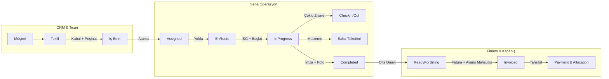
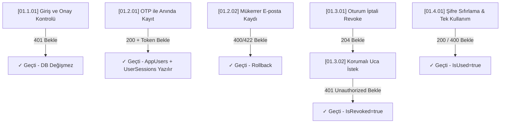
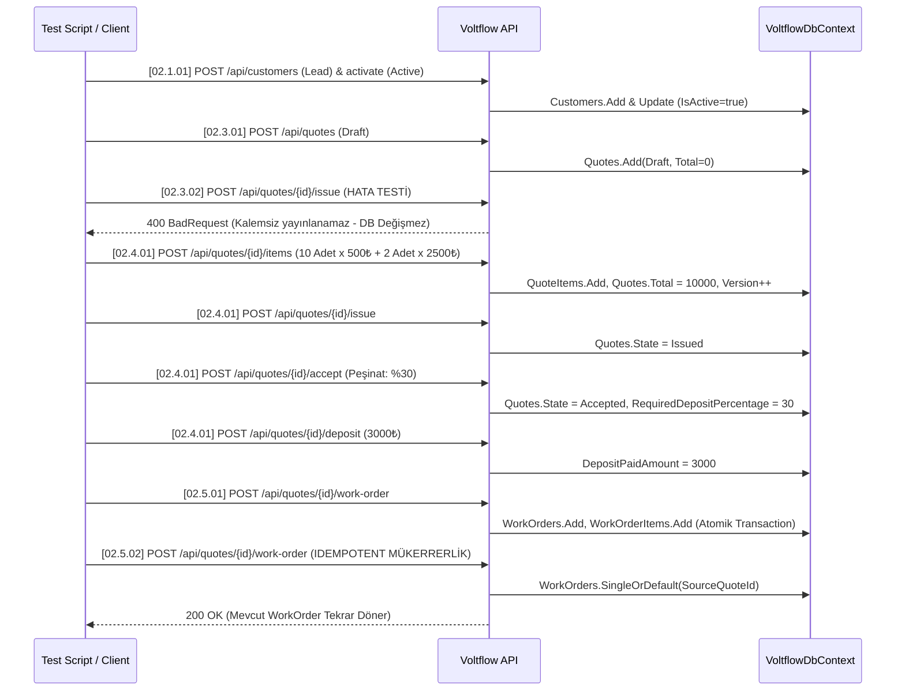
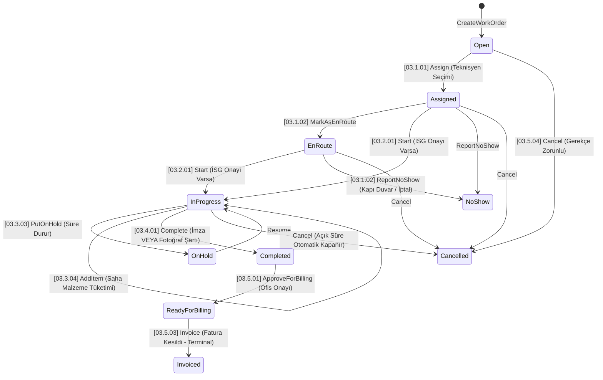
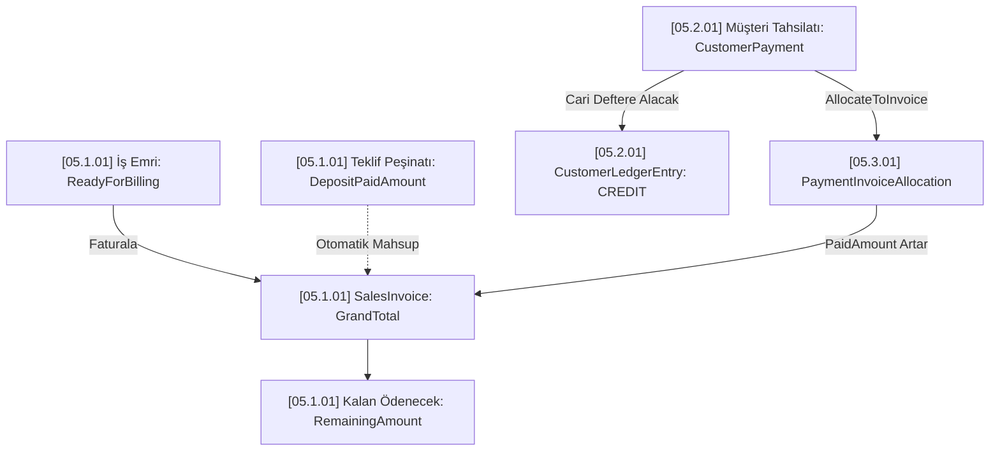
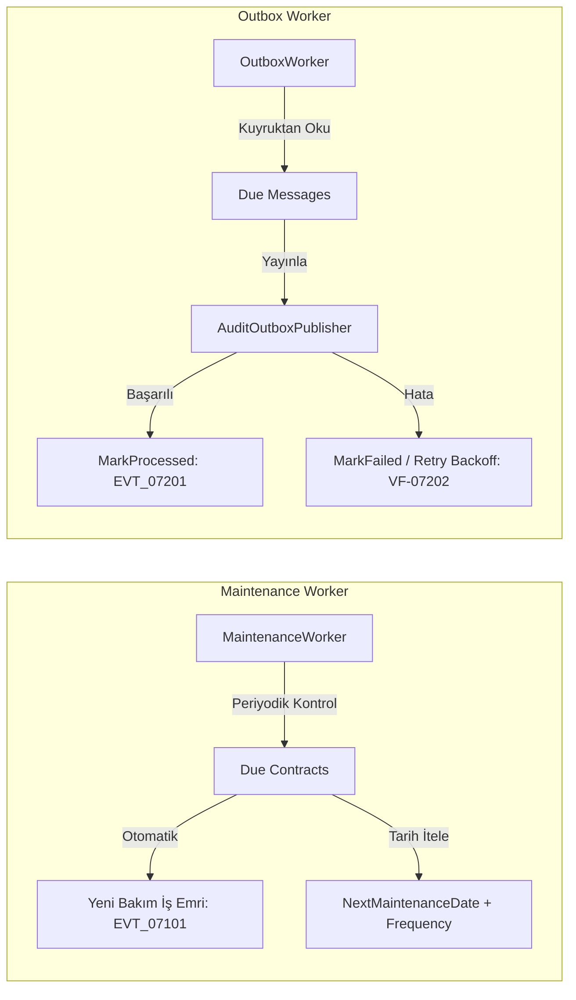

# Voltflow: Tüm İş Akışları, Alt Kırılımlar ve Arıza / İptal / Rollback Matrisi

Bu doküman, Voltflow saha servis yönetim (FSM) platformunun tüm uçtan uca iş akışlarını, alt kırılımlarını, durum geçişlerini (state machines), hata (fail/exception), iptal (cancel), geri alma (rollback) ve telafi (compensation) mekanizmalarını **Voltflow Unified Taxonomy (VUT: `MM.F.SS`)** standardı doğrultusunda eksiksiz olarak belgeler.

---

## Giriş: Genel Mimari ve İş Akışı Yaklaşımı

Voltflow, Clean Architecture ilkeleri ve Son Durum Makinesi (Finite State Machine - FSM) prensipleri üzerine inşa edilmiştir.

### Temel Prensipler:
1. **İş Akışı Koruması (FSM Integrity):** Durum geçişleri yalnızca izin verilen yönlerde gerçekleşir. Terminal durumdaki kayıtlar (ör. `Invoiced`, `Cancelled`, `Rejected`) üzerinde geriye dönük mutasyon yapılamaz.
2. **Hata Maskeleme ve Tip Güvenliği (`Result<T>` Monad):** Uygulama katmanında iş kuralı ihlalleri `Result<T>.Fail(message)` ile taşınır, HTTP katmanına RFC 7807 uyumlu Problem Details olarak yansıtılır.
3. **Çift Yazma Koruması (Transactional Outbox):** Dış dünyaya (bildirim, e-posta, SMS) bağımlı olaylar doğrudan domain transaction'ı içinde çağrılmaz; aynı transaction ile Outbox tablosuna yazılır ve arka plan worker'ları tarafından üstel geri çekilme (exponential backoff) ile tüketilir.
4. **Idempotency ve Concurrency Güvencesi:** Kritik uç noktalar (`ExecutionGuardFilter`) ile mükerrer isteklere karşı korunur; varlıklar `uint Version` alanı ile iyimser eşzamanlılık (optimistic concurrency) korumasına sahiptir.

---

## 1. Kimlik, Yetkilendirme ve Oturum Yönetimi (Identity & Auth)

### [01.1.01] Kullanıcı Girişi ve Yetki Reddi (Login & Approval Gate)
* **Akış ID:** `01.1.01` | **Hata Kodları:** `VF-01101` (Geçersiz Kimlik), `VF-01102` (Onaysız Hesap)
* **İstemci İzleme:** `Screen: SCR-0110-LoginView` | `Action: ACT-01101-SubmitLogin`
* **Aktörler:** Kayıtlı Kullanıcı.
* **Happy Path:**
  1. `POST /api/auth/login` ile e-posta ve şifre gönderilir.
  2. Kullanıcı e-posta ile bulunur, şifre hash'i PBKDF2 ile doğrulanır.
  3. Kullanıcının onay durumu (`IsApproved == true`) teyit edilir.
  4. Kullanıcı rolleri çekilir, 60 dakika geçerli JWT üretilir.
  5. `UserSessions` tablosuna ve oturum önbelleğine oturum kaydı atılır (`AddAsync`).
* **Hata / Fail Senaryoları:**
  * **Geçersiz Kimlik (`VF-01101`):** Kullanıcı bulunamazsa veya şifre yanlışsa `401 Unauthorized: Invalid credentials.` döner.
  * **Onay Bekleyen Hesap (`VF-01102`):** Kullanıcı var ancak henüz admin tarafından onaylanmamışsa (`IsApproved == false`) `401 Unauthorized: Account approval is pending.` döner.
* **İptal / Rollback Invariant:**
  * Giriş esnasında oturum tablosuna yazılamazsa token istemciye verilmez, `UserSessions` tablosuna kayıt eklenmez.

---

### [01.2.01] Kullanıcı Kaydı ve Master OTP (User Registration & Master OTP)
* **Akış ID:** `01.2.01` | **Hata Kodları:** `VF-01201` (Başarılı Master OTP), `VF-01202` (Mükerrer E-posta)
* **İstemci İzleme:** `Screen: SCR-0120-RegisterView` | `Action: ACT-01201-RegisterSubmit`
* **Aktörler:** Anonim Kullanıcı.
* **Happy Path (Normal Akış):**
  1. İstemci `POST /api/auth/register` ucuna Ad, E-posta ve Parola gönderir.
  2. Parola PBKDF2 ile hash'lenir, kullanıcı `AppUsers` tablosuna `IsApproved = false`, `IsVerified = false` olarak eklenir.
  3. Yanıt olarak `202 Accepted` dönülür; hesap yönetici onay havuzuna düşer.
* **Alt Kırılım (OTP / Master Test Kaydı):**
  * İstekte `request.Otp == "000000"` gönderilirse kullanıcı otomatik olarak `IsVerified = true`, `IsApproved = true` yapılır; varsayılan rol atanır ve anında geçerli bir JWT üretilerek `200 OK` ile döndürülür.
* **Hata / Fail Senaryoları:**
  * **E-posta Çakışması (`VF-01202`):** E-posta adresi veritabanında zaten varsa işlem durdurulur (`400/422 Duplicate email rejection`).
  * **Zayıf Parola:** Parola 8 karakterden kısaysa doğrulama hatası verilir (`400 BadRequest`).
* **İptal / Rollback Invariant:**
  * Kayıt sırasında hata oluşursa UnitOfWork transaction'ı iptal edilir; `AppUsers` tablosuna yarım kayıt eklenmez.

---

### [01.3.01] Oturum İptali ve Güvenli Çıkış (Session Revocation & Logout)
* **Akış ID:** `01.3.01` | **Hata Kodları:** `VF-01301` (Oturum İptali), `VF-01302` (İptal Edilmiş Erişim)
* **İstemci İzleme:** `Screen: SCR-0130-SessionManager` | `Action: ACT-01301-RevokeSession`
* **Happy Path:**
  1. `POST /api/auth/session/revoke` çağrılır.
  2. `UserSessions` tablosundaki ilgili token bulunup `session.Revoke()` ile `IsRevoked = true` yapılır.
  3. Oturum önbelleğinden token düşürülür (`InvalidateSessionAsync`).
  4. `SessionValidationMiddleware` sonraki isteklerde bu token'ı gördüğü anda `401 Unauthorized` döner (`VF-01302`).
* **İptal / Telafi Invariant:**
  * Önbellek düşürmesi başarısız olsa bile veritabanındaki `IsRevoked = true` bayrağı yetkilendirmeyi kalıcı olarak engeller.

---

### [01.4.01] Şifre Sıfırlama ve Tek Kullanımlık Token (Password Reset Flow)
* **Akış ID:** `01.4.01` | **Hata Kodları:** `VF-01401` (Sıfırlama Başarılı), `VF-01402` (Token Geçersiz/Kullanılmış)
* **İstemci İzleme:** `Screen: SCR-0140-PasswordResetView` | `Action: ACT-01401-ResetPassword`
* **Happy Path:**
  1. `POST /api/auth/password-reset/request` ile e-posta iletilir.
  2. Sistem 32-byte rastgele token üretir ve 30 dakika geçerlilik süresiyle `PasswordResetTokens` tablosuna yazar.
  3. `POST /api/auth/password-reset/complete` ile token ve yeni şifre gönderilir.
  4. Token doğrulanır, tek kullanımlık olarak `MarkUsed()` edilir, şifre güncellenir ve hesap aktif edilir.
* **Hata / Fail Senaryoları (`VF-01402`):**
  * Süresi dolmuş (`ExpiresAt <= UtcNow`) veya daha önce kullanılmış (`IsUsed == true`) token ile istek atılırsa `400 BadRequest: Reset token is invalid or expired` döner.

---

### [01.4.03] Yönetici Onayı ve Rol Yönetimi (Admin Approval & RBAC)
* **Akış ID:** `01.4.03` | **Hata Kodu:** `VF-01403`
* **İstemci İzleme:** `Screen: SCR-0140-AdminUsersView` | `Action: ACT-01403-ApproveAndAssignRoles`
* **Happy Path:**
  1. Admin onay bekleyen kullanıcı için `POST /api/auth/users/{id}/approve` çağırır $\rightarrow$ `user.Approve()`.
  2. Admin `POST /api/auth/users/{id}/roles` çağırarak kullanıcıya `Admin`, `Manager`, `Technician` rollerini atar.
* **Hata / Fail:**
  * Zaten onaylı kullanıcı için mükerrer onay verilirse `422 User is already approved` döner.

---

## 2. Müşteri, Teklif ve Siparişe Dönüşüm (CRM & Quote-to-Order)

### [02.1.01] Müşteri Kaydı ve Aktivasyon (Lead to Active Conversion)
* **Akış ID:** `02.1.01` | **Hata Kodları:** `VF-02101` (Aktivasyon Başarılı), `VF-02102` (Mükerrer Müşteri E-postası)
* **İstemci İzleme:** `Screen: SCR-0210-CustomerView` | `Action: ACT-02101-CreateAndActivateCustomer`
* **Happy Path:**
  1. `POST /api/customers` ile müşteri adayı oluşturulur (`IsActive = false`, `Type = Lead`).
  2. `POST /api/customers/{id}/activate` ile `ConvertToActive()` çalıştırılır (`IsActive = true`, `Type = Active`).
* **Hata / Fail Senaryoları (`VF-02102`):**
  * Kayıtlı e-posta adresi tekrar girilirse `400/422 Customer already exists` ile reddedilir.

---

### [02.2.01] Tesis (Site) ve Ekipman (Asset) Yönetimi
* **Akış ID:** `02.2.01` | **Hata Kodu:** `VF-02201`
* **İstemci İzleme:** `Screen: SCR-0220-AssetHierarchyView` | `Action: ACT-02201-LinkSiteAndAsset`
* **Happy Path:**
  1. Fabrika veya lokasyon `CustomerSite` olarak eklenir (`CustomerId, Name, Address`).
  2. Trafo, jeneratör veya pano `CustomerAsset` olarak bağlanır.
* **Invariant:** Olmayan bir `CustomerId`'ye tesis veya varlık bağlanamaz (FK constraint).

---

### [02.3.01] Teklif Taslağı ve Kalemsiz Yayınlama Engeli (Draft & Empty Quote Issue Gate)
* **Akış ID:** `02.3.01` | **Hata Kodları:** `VF-02301` (Taslak/Kalem Ekleme), `VF-02302` (Kalemsiz Yayınlama Engeli)
* **İstemci İzleme:** `Screen: SCR-0230-QuoteDraftView` | `Action: ACT-02301-IssueQuote`
* **Happy Path:**
  1. `POST /api/quotes` ile `Draft` statüsünde teklif açılır.
  2. `POST /api/quotes/{id}/items` ile hizmet/malzeme kalemleri eklenir (`Total` otomatik güncellenir).
* **Hata / Fail (`VF-02302`):**
  * Kalem içermeyen teklif yayınlanamaz (`400/422: A quote must contain at least one item before it can be issued`).
* **DB Invariant:** Hata durumunda `Quotes.State` kesinlikle `Draft` kalır, `Issued` olmaz.

---

### [02.4.01] Teklif Kabulü, Kalem Toplamı ve Peşinat Tahsilatı (Accept, Items Total & Deposit)
* **Akış ID:** `02.4.01` | **Hata Kodları:** `VF-02401` (Kabul ve Peşinat), `VF-02402` (Red Gerekçesi Eksikliği), `VF-02403` (Zaman Aşımı)
* **İstemci İzleme:** `Screen: SCR-0240-QuoteApprovalView` | `Action: ACT-02401-AcceptQuote`
* **Happy Path:**
  1. `POST /api/quotes/{id}/accept` ile teklif kabul edilir (`State = Accepted`, `RequiredDepositPercentage = 30`).
  2. `POST /api/quotes/{id}/deposit` ile peşinat ödenir $\rightarrow$ `DepositPaidAmount = 3000`.
* **Red ve Zaman Aşımı Kuralları:**
  * Müşteri onay vermezse `POST /api/quotes/{id}/reject` çağrılır (`rejectionReason` zorunludur).
  * Vadesi dolan teklifler `POST /api/quotes/{id}/expire` ile `Expired` durumuna alınır; terminal durumlardaki teklifler süresi dolsa dahi expire edilemez.

---

### [02.5.01] Tekliften İş Emrine Dönüştürme ve Idempotency Kontrolü (Conversion to Work Order)
* **Akış ID:** `02.5.01` | **Hata Kodları:** `VF-02501` (Başarılı Dönüşüm), `VF-02502` (Idempotent Tekrar), `VF-02503` (Kabul Edilmemiş Teklif Engeli)
* **İstemci İzleme:** `Screen: SCR-0250-QuoteConvertView` | `Action: ACT-02501-ConvertToWorkOrder`
* **Happy Path:**
  1. `POST /api/quotes/{id}/work-order` çağrılır.
  2. Teklifin `Accepted` olduğu doğrulanır, iş emri oluşturulur ve kalemler kopyalanır.
* **Idempotency Güvencesi (`VF-02502`):**
  * Aynı teklif için tekrar iş emri dönüştürme isteği gelirse, sistem mükerrer kayıt açmaz; daha önce oluşturulmuş mevcut iş emrini döndürür (`Count == 1`).

---

### [02.6.01] Sahada Kapsam Değişikliği (Change Order / Saha Ek Teklifi)
* **Akış ID:** `02.6.01` | **Hata Kodu:** `VF-02601`
* **Happy Path:**
  * Teknisyen sahada ek hasar tespit ettiğinde ana iş emrine bağlı ek teklif açar (`MarkAsChangeOrder(parentWorkOrderId)`).
* **Rollback:** Müşteri ek maliyeti reddederse Change Order `Rejected` yapılır; orijinal iş emri etkilenmeden devam eder.

---

## 3. Saha Operasyonları ve İş Emri Yaşam Döngüsü (Work Orders & Field Service FSM)

### [03.1.01] İş Emri Açılışı ve Atama (Open to Assigned)
* **Akış ID:** `03.1.01` | **Hata Kodu:** `VF-03101`
* **İstemci İzleme:** `Screen: SCR-0310-WorkOrderDispatchView` | `Action: ACT-03101-AssignWorkOrder`
* **Happy Path:** `POST /api/workorders/{id}/assign` ile teknisyen kullanıcı ID'si atanır $\rightarrow$ Statü: `Assigned`.

---

### [03.1.02] Yola Çıkış ve Adreste Bulunamama (EnRoute to NoShow)
* **Akış ID:** `03.1.02` | **Hata Kodu:** `VF-03102`
* **Happy Path:**
  * Teknisyen yola çıktığında `POST /api/workorders/{id}/en-route` tıklar $\rightarrow$ `EnRoute`.
  * Saha kapalıysa `POST /api/workorders/{id}/no-show` çağrılır (`Reason` zorunludur) $\rightarrow$ `NoShow`.

---

### [03.2.01] İSG Kontrolü ve İşi Başlatma (Safety Checklist Gate & Start)
* **Akış ID:** `03.2.01` | **Hata Kodları:** `VF-03201` (İSG Onaysız Başlatma Engeli), `VF-03202` (Başarılı Başlatma)
* **İstemci İzleme:** `Screen: SCR-0320-SafetyChecklistView` | `Action: ACT-03201-StartWithoutSafety`
* **Happy Path:**
  1. Teknisyen kontrol listesini doldurur: `POST /api/workorders/{id}/safety-checklist` $\rightarrow$ `IsSafetyChecklistCompleted = true`.
  2. `POST /api/workorders/{id}/start` çağrılarak iş başlatılır $\rightarrow$ Statü: `InProgress`.
* **Hata / Fail (`VF-03201`):**
  * İSG formu onaylanmadan iş başlatılamaz (`400/422: Cannot start work order without completing the safety checklist`).
* **DB Invariant:** Hatalı istek sonrası `WorkOrders.Status = Assigned` olarak kalır, `InProgress` olmaz.

---

### [03.3.01] Saha Zaman Takibi (Multi-Visit Check-In & Check-Out)
* **Akış ID:** `03.3.01` | **Hata Kodları:** `VF-03301` (Zaman Kaydı Başarılı), `VF-03302` (Mükerrer Check-In Engeli)
* **İstemci İzleme:** `Screen: SCR-0330-WorkOrderTimeTracker` | `Action: ACT-03301-CheckIn`
* **Happy Path:**
  1. `POST /api/workorders/{id}/check-in` ile zaman kaydı açılır (`CheckOutTime = null`).
  2. `POST /api/workorders/{id}/check-out` ile o anki UTC saati ile kapatılır.
* **Hata / Fail (`VF-03302`):**
  * Zaten açık bir Check-In varken ikinci kez Check-In yapılamaz (`400/422: Already checked in. Please check out first`).
* **DB Invariant:** Açık oturum varken ikinci satır eklenmez (`Count == 1` korunur).

---

### [03.3.03] Beklemeye Alma ve Otomatik Check-Out Telafisi (On Hold & Auto Check-Out Compensation)
* **Akış ID:** `03.3.03` | **Hata Kodu:** `VF-03303`
* **İstemci İzleme:** `Screen: SCR-0330-WorkOrderHoldModal` | `Action: ACT-03303-PutOnHold`
* **Happy Path:**
  * `POST /api/workorders/{id}/hold` çağrılır (`Reason` zorunludur) $\rightarrow$ Statü: `OnHold`.
* **Otomatik Telafi (Compensation Invariant):**
  * Teknisyen Check-Out yapmayı unutup işi beklemeye aldığında, açık `WorkOrderTimeEntries` satırı sistem tarafından otomatik olarak o anki UTC saati ile kapatılır ve notuna telafi açıklaması eklenir.
  * Sorun çözüldüğünde `POST /api/workorders/{id}/resume` ile iş `InProgress` durumuna döner.

---

### [03.3.04] Sahada Malzeme Tüketimi (Field Consumption)
* **Akış ID:** `03.3.04` | **Hata Kodu:** `VF-03304`
* **Happy Path:** Teknisyen `POST /api/workorders/{id}/items` ile malzeme işler, `WorkOrders.Total` tutarı anında güncellenir.

---

### [03.4.01] İş Kanıtı ve Tamamlama (Proof of Work & Complete with Outbox)
* **Akış ID:** `03.4.01` | **Hata Kodları:** `VF-03401` (Kanıtsız Kapatma Engeli), `VF-03402` (Başarılı Kapanış)
* **İstemci İzleme:** `Screen: SCR-0340-WorkOrderSignModal` | `Action: ACT-03401-CompleteWorkOrder`
* **Happy Path:**
  1. `POST /api/workorders/{id}/complete` ile `signatureData` veya `proofOfWorkPhotoUrl` gönderilir.
  2. Statü `Completed` yapılır, açık zaman kaydı otomatik kapatılır, `OutboxMessages` tablosuna `EVT_03402_WorkOrderCompleted` eklenir.
* **Hata / Fail (`VF-03401`):**
  * Hem imza hem fotoğraf boş gönderilirse işlem kesinlikle reddedilir (`400/422: Proof of work (signature or photo) is required`).
* **DB Invariant:** Durum `InProgress` olarak kalır, `Completed` yapılamaz.

---

### [03.5.01] Ofis İnceleme Kapısı ve Faturalama (Review Gate & Invoicing)
* **Akış ID:** `03.5.01` | **Hata Kodları:** `VF-03501` (Onaysız Faturalama Engeli), `VF-03502` (Ofis Onayı), `VF-03503` (Faturalandı)
* **İstemci İzleme:** `Screen: SCR-0350-BillingReviewView` | `Action: ACT-03501-InvoiceDirectly`
* **Happy Path:**
  1. Operasyon yöneticisi `POST /api/workorders/{id}/approve-billing` çağırır $\rightarrow$ `ReadyForBilling` (`VF-03502`).
  2. Muhasebe faturayı kestiğinde `POST /api/workorders/{id}/invoice` çağrılır $\rightarrow$ `Invoiced` (Terminal State) (`VF-03503`).
* **Hata / Fail (`VF-03501`):**
  * Ofis onayı almamış `Completed` iş emri doğrudan faturalanamaz (`400/422: Only approved (ready for billing) work orders can be invoiced`).

---

### [03.5.04] İş Emri İptali ve Terminal Durum Koruması (Cancellation & Terminal Invariant)
* **Akış ID:** `03.5.04` | **Hata Kodu:** `VF-03504`
* **Happy Path:** Açık iş emri için `POST /api/workorders/{id}/cancel` çağrılır $\rightarrow$ Statü: `Cancelled`.
* **Terminal Koruması (`VF-03504`):**
  * `Completed` veya `Invoiced` statüsündeki iş emirleri kesinlikle iptal edilemez (`400/422: Completed or Invoiced work orders cannot be cancelled`).

---

### [03.5.05] Garanti ve Callback İş Emirleri (Warranty / Callback)
* **Akış ID:** `03.5.05` | **Hata Kodu:** `VF-03505`
* **FSM Kuralı:** Kapatılmış bir iş emri tekrar açılamaz; nükseden arızalar için eski iş emri referans verilerek `LinkToParentWorkOrder(parentWorkOrderId)` ile yeni bir garanti iş emri oluşturulur.

---

## 4. Depo ve Stok Yönetimi (Inventory & Warehouses)

### [04.1.01] Stok Ayarlama ve Eksi Stok Engeli (Stock Adjustment & Negative Stock Gate)
* **Akış ID:** `04.1.01` | **Hata Kodları:** `VF-04101` (Eksi Stok Engeli & Rollback), `VF-04102` (Geçerli Stok Hareketi)
* **İstemci İzleme:** `Screen: SCR-0410-StockAdjustView` | `Action: ACT-04101-AdjustNegativeStock`
* **Happy Path:**
  1. `POST /api/inventory/adjust` ile `MaterialCode` ve pozitif/geçerli `Delta` gönderilir.
  2. `MaterialStock.QuantityOnHand` güncellenir ve `StockMovements` tablosuna denetim satırı eklenir (`VF-04102`).
* **Hata / Fail (`VF-04101`):**
  * Düşüm sonucunda stok sıfırın altına inecekse istek reddedilir (`400/422: Stock cannot go below zero.`).
* **Atomik Rollback Invariant:**
  * Stok miktarı değişmez; `StockMovements` tablosuna hiçbir satır eklenmez.

---

### [04.2.01] Stok Rezerve Etme ve İade (Reserve & Release)
* **Akış ID:** `04.2.01` | **Hata Kodları:** `VF-04201` (Rezervasyon Başarılı), `VF-04202` (Yetersiz Serbest Stok), `VF-04203` (İade Başarılı)
* **İstemci İzleme:** `Screen: SCR-0420-StockReserveModal` | `Action: ACT-04201-ReserveStock`
* **Happy Path:**
  * `POST /api/inventory/reserve` çağrılır $\rightarrow$ `ReservedQuantity` artar, `AvailableQuantity` azalır.
* **Hata / Fail (`VF-04202`):**
  * Serbest stoktan (`AvailableQuantity`) fazla rezervasyon yapılamaz (`400/422: Insufficient available quantity.`).

---

## 5. Finans, Faturalama ve Tahsilat Eşleştirme (Finance & Billing)

### [05.1.01] Satış Faturası ve Peşinat Mahsubu (Sales Invoice & Deposit Reconciliation)
* **Akış ID:** `05.1.01` | **Hata Kodları:** `VF-05101` (Fatura ve Mahsup Başarılı), `VF-05102` (Fatura İptali / Ters Kayıt)
* **İstemci İzleme:** `Screen: SCR-0510-InvoicingView` | `Action: ACT-05101-GenerateInvoice`
* **Happy Path:**
  1. Tamamlanan işler için `SalesInvoice` kesilir.
  2. Teklif aşamasında alınan peşinat faturanın `AppliedDepositAmount` alanına aktarılır.
  3. Kalan tutar otomatik hesaplanır: $\text{RemainingAmount} = \text{GrandTotal} - \text{PaidAmount} - \text{AppliedDepositAmount}$.
* **Muhasebe Kuralı (`VF-05102`):** Kesilen faturalar silinemez; hatalı kayıtlar için `InvoiceType.CreditNote` ters kayıt kesilir.

---

### [05.2.01] Tahsilat Kaydı ve Cari Hesap Defteri (Payment Receipt & Ledger)
* **Akış ID:** `05.2.01` | **Hata Kodları:** `VF-05201` (Tahsilat Başarılı), `VF-05202` (Geçersiz Tutar)
* **İstemci İzleme:** `Screen: SCR-0520-PaymentEntryView` | `Action: ACT-05201-ReceivePayment`
* **Happy Path:**
  1. `POST /api/payments` ile tahsilat girilir (`CustomerId, Amount, PaymentMethod`).
  2. `CustomerPayments` satırı açılır ve `CustomerLedgerEntries` tablosuna Alacak yönünde (`CREDIT`) defter kaydı atılır.
* **Hata / Fail (`VF-05202`):** Tutar sıfır veya negatif girilemez (`Guard.AgainstNegativeOrZero`).

---

### [05.3.01] Tahsilatın Faturaya Dağıtımı ve Aşım Engeli (Payment Allocation & Over-Allocation Gate)
* **Akış ID:** `05.3.01` | **Hata Kodları:** `VF-05301` (Dağıtım Başarılı), `VF-05302` (Ödeme Bakiyesi Aşımı), `VF-05303` (Fatura Borcu Aşımı), `VF-05304` (Mükerrer Dağıtım)
* **İstemci İzleme:** `Screen: SCR-0530-PaymentAllocationModal` | `Action: ACT-05301-AllocatePayment`
* **Happy Path:**
  1. `POST /api/payments/allocate` ile `PaymentId`, `InvoiceId` ve `Amount` gönderilir.
  2. `payment.Allocate(amount)` ve `invoice.Allocate(amount)` çalıştırılır; `PaymentInvoiceAllocation` satırı oluşturulur.
* **Hata / Fail Senaryoları:**
  * **Ödeme Bakiye Yetersizliği (`VF-05302`):** Tutar tahsilatın serbest bakiyesini aşarsa engellenir (`400/422: Payment allocation exceeds the unallocated amount`).
  * **Fatura Borç Yetersizliği (`VF-05303`):** Tutar faturanın kalan borcunu aşarsa engellenir (`400/422: Invoice allocation exceeds the remaining invoice amount`).
  * **Mükerrer Dağıtım (`VF-05304`):** Aynı ödeme aynı faturaya daha önce bağlanmışsa engellenir (`400/422: This payment is already allocated to the invoice`).

---

## 6. Proje Yönetimi ve Hakediş Sistemi (Projects & Progress Billing)

### [06.1.01] Proje Başlatma ve Faz Tanımlama
* **Akış ID:** `06.1.01` | **Hata Kodu:** `VF-06101`
* **Happy Path:** `POST /api/projects` ile bütçe tanımlanır, `POST /api/projects/{id}/phases` ile etaplar bağlanır.

---

### [06.2.01] Hakediş Talebi ve Onayı (Progress Billing)
* **Akış ID:** `06.2.01` | **Hata Kodları:** `VF-06201` (Hakediş Onayı), `VF-06202` (Geçersiz Onay Tutarı)
* **Happy Path:** Saha hakediş başvurusu yapar, kontrol mühendisi `billing.Approve(approvedAmount)` ile onaylar. Net ödenecek tutar sistemce hesaplanır: $\text{NetPayable} = \text{ApprovedAmount} - \text{DeductionAmount}$.
* **Hata (`VF-06202`):** Onaylanan tutar kesinti tutarının altında girilemez (`400/422: Approved amount cannot be lower than deduction`).

---

## 7. Arka Plan Servisleri ve Otomasyon (Background Workers)

### [07.1.01] Periyodik Bakım Otomasyonu (MaintenanceProcessor)
* **Akış ID:** `07.1.01` | **Hata Kodu:** `VF-07101`
* **Happy Path:** Vadesi gelen aktif sözleşmeler taranır, otomatik `WorkOrder` oluşturulur ve sözleşmenin `NextMaintenanceDate` tarihi periyot kadar ileri ötelenir.

---

### [07.2.01] Güvenilir Olay Dağıtımı (Transactional Outbox Processor)
* **Akış ID:** `07.2.01` | **Hata Kodları:** `VF-07201` (İşlendi), `VF-07202` (Yeniden Deneme / Backoff)
* **Happy Path:** İşlenmemiş Outbox kayıtları 100'lük gruplar halinde çekilir, yayınlanır ve `MarkProcessedAsync` ile mühürlenir. Hata durumunda üstel geri çekilme süresi belirlenir.

---

### [07.3.01] Hatırlatıcı ve SLA Takibi (ReminderProcessor)
* **Akış ID:** `07.3.01` | **Hata Kodu:** `VF-07301`
* **Happy Path:** Geciken işler taranır, deneme sayısı artırılır ve bir sonraki bildirim zamanı ötelenir.

---

## 8. Sistem Altyapısı, Güvenlik ve Dayanıklılık (Cross-Cutting Infrastructure)

### [08.1.01] Idempotency Key Kilidi ve Gövde Uyuşmazlığı (ExecutionGuardFilter)
* **Akış ID:** `08.1.01` | **Hata Kodları:** `VF-08101` (Hash Uyuşmazlığı), `VF-08102` (Otomatik Replay)
* **Happy Path:** İlk istekte kilit alınır (`Acquired`), işlem tamamlandığında sonuç saklanır (`Resolved`).
* **Kural (`VF-08101`):** Aynı anahtar ile farklı bir JSON gövdesi gelirse işlem durdurulur (`409 Conflict: Request hash mismatch`). Aynı gövde geldiğinde ise saklanan yanıt doğrudan dönülür (`Replay`).

---

### [08.2.01] Hız Sınırlama ve Dağıtık Kota (Rate Limiting)
* **Akış ID:** `08.2.01` | **Hata Kodu:** `VF-08201`
* **Kural:** Kota aşıldığında sistem `429 TooManyRequests` döner ve isteği controller'a ulaştırmadan keser.

---

### [08.3.01] İyimser Eşzamanlılık (Optimistic Concurrency / Version)
* **Akış ID:** `08.3.01` | **Hata Kodu:** `VF-08301`
* **Kural:** İki kullanıcı aynı varlığı aynı anda güncellemeye kalkarsa versiyon uyuşmazlığı nedeniyle biri `409 Conflict` alır; ezici güncelleme engellenir.

---

### [08.4.01] Global Problem Details ve Hata Maskeleme
* **Akış ID:** `08.4.01` | **Hata Kodu:** `VF-08401`
* **Kural:** Sunucu içi hassas yığın izleri (stack trace) dışarı sızdırılmaz; RFC 7807 uyumlu Problem Details nesnesi `TraceId` ve `OperationId` ile istemciye verilir.

---

## 9. Hata Kodları ve Çözüm Matrisi

Aşağıdaki tablo, Voltflow platformunda meydana gelebilecek tüm durum ihlallerini, standart hata kodlarını (`VF-MMFSS`), kaynak servisi, ilgili istemci ekranı/aksiyonunu ve çözüm adımlarını listeler:

| Akış ID | Hata Kodu | HTTP | Kaynak Servis | Frontend Ekran & Aksiyon (`X-Client-*`) | Hata Mesajı / Kural | Çözüm / Kurtarma Adımı |
| :--- | :--- | :--- | :--- | :--- | :--- | :--- |
| **01.1.01** | `VF-01101` | 401 | AuthService | `SCR-0110-LoginView` / `ACT-01101-SubmitLogin` | `Invalid credentials.` | Kullanıcı adı veya şifre kontrol edilmelidir. |
| **01.1.01** | `VF-01102` | 401 | AuthService | `SCR-0110-LoginView` / `ACT-01101-SubmitLogin` | `Account approval is pending.` | Sistem yöneticisinin kullanıcı onayını (`Approve`) yapması gerekir. |
| **01.2.01** | `VF-01202` | 422 | AuthService | `SCR-0120-RegisterView` / `ACT-01201-RegisterSubmit` | `A user with this email already exists.` | Farklı bir e-posta kullanılmalı veya şifre sıfırlanmalıdır. |
| **01.4.01** | `VF-01402` | 400 | AuthService | `SCR-0140-PasswordResetView` / `ACT-01401-ResetPassword`| `Reset token is invalid or expired.` | Yeni bir şifre sıfırlama bağlantısı talep edilmelidir. |
| **02.1.01** | `VF-02102` | 422 | CustomerService | `SCR-0210-CustomerView` / `ACT-02101-CreateCustomer` | `Customer already exists.` | Aynı e-postaya sahip müşteri mevcut; mevcut kayıt güncellenmeli. |
| **02.3.01** | `VF-02302` | 422 | QuoteService | `SCR-0230-QuoteDraftView` / `ACT-02301-IssueQuote` | `A quote must contain at least one item before it can be issued.` | Teklife en az bir hizmet/malzeme kalemi eklenmelidir. |
| **02.5.01** | `VF-02503` | 422 | QuoteService | `SCR-0250-QuoteConvertView` / `ACT-02501-ConvertToWorkOrder` | `Only accepted quotes can create work orders.` | Müşterinin teklifi onaylaması (`Accept`) sağlanmalıdır. |
| **03.2.01** | `VF-03201` | 422 | WorkOrderService | `SCR-0320-SafetyChecklistView` / `ACT-03201-StartWorkOrder`| `Cannot start work order without completing the safety checklist.` | `safety-checklist` formu tamamlanmalıdır. |
| **03.3.01** | `VF-03302` | 422 | WorkOrderService | `SCR-0330-TimeTrackerView` / `ACT-03301-CheckIn` | `Already checked in. Please check out first.` | Devam eden açık ziyaret için önce `check-out` yapılmalıdır. |
| **03.4.01** | `VF-03401` | 422 | WorkOrderService | `SCR-0340-CompleteModal` / `ACT-03401-CompleteWorkOrder` | `Proof of work (signature or photo) is required to complete the work order.` | Müşteri dijital imzası veya saha fotoğrafı yüklenmelidir. |
| **03.5.01** | `VF-03501` | 422 | WorkOrderService | `SCR-0350-BillingReviewView` / `ACT-03501-InvoiceDirectly` | `Only approved (ready for billing) work orders can be invoiced.` | Operasyon yöneticisi `approve-billing` vermelidir. |
| **03.5.04** | `VF-03504` | 422 | WorkOrderService | `SCR-0350-WorkOrderDetail` / `ACT-03504-CancelWorkOrder` | `Completed or Invoiced work orders cannot be cancelled.` | Kapatılmış iş iptal edilemez; gerekiyorsa Callback açılmalıdır. |
| **04.1.01** | `VF-04101` | 422 | InventoryService | `SCR-0410-StockAdjustView` / `ACT-04101-AdjustNegativeStock` | `Stock cannot go below zero.` | Depoya stok girişi yapılmalı veya düşüm miktarı küçültülmelidir. |
| **04.2.01** | `VF-04202` | 422 | InventoryService | `SCR-0420-StockReserveModal` / `ACT-04201-ReserveStock` | `Insufficient available quantity.` | Rezervasyon miktarı mevcut serbest stokla sınırlandırılmalıdır. |
| **05.3.01** | `VF-05302` | 422 | PaymentService | `SCR-0530-PaymentAllocation` / `ACT-05301-AllocatePayment` | `Payment allocation exceeds the unallocated amount.` | Tahsis tutarı tahsilatın serbest bakiyesine eşit/küçük olmalıdır. |
| **05.3.01** | `VF-05303` | 422 | PaymentService | `SCR-0530-PaymentAllocation` / `ACT-05301-AllocatePayment` | `Invoice allocation exceeds the remaining invoice amount.` | Tahsis tutarı faturanın kalan borcunu aşamaz. |
| **05.3.01** | `VF-05304` | 422 | PaymentService | `SCR-0530-PaymentAllocation` / `ACT-05301-AllocatePayment` | `This payment is already allocated to the invoice.` | Mükerrer eşleştirme yapılamaz. |
| **06.2.01** | `VF-06202` | 422 | ProjectService | `SCR-0620-ProgressBillingView` / `ACT-06201-ApproveBilling` | `Approved amount cannot be lower than deduction.` | Onaylanan tutar kesintiden büyük olmalıdır. |
| **08.1.01** | `VF-08101` | 409 | System / Guard | `GlobalMiddleware` / `ACT-08101-IdempotencyGuard` | `Request hash mismatch.` | Aynı idempotency anahtarıyla farklı gövde gönderilmemelidir. |
| **08.2.01** | `VF-08201` | 429 | System / RateLimit| `GlobalMiddleware` / `ACT-08201-RateLimitCheck` | `Too many requests.` | `Retry-After` süresi kadar beklenmelidir. |
| **08.3.01** | `VF-08301` | 409 | System / Version | `GlobalMiddleware` / `ACT-08301-ConcurrencyCheck` | `Concurrency conflict.` | Güncel veri tekrar çekilmeli ve işlem tekrarlanmalıdır. |
